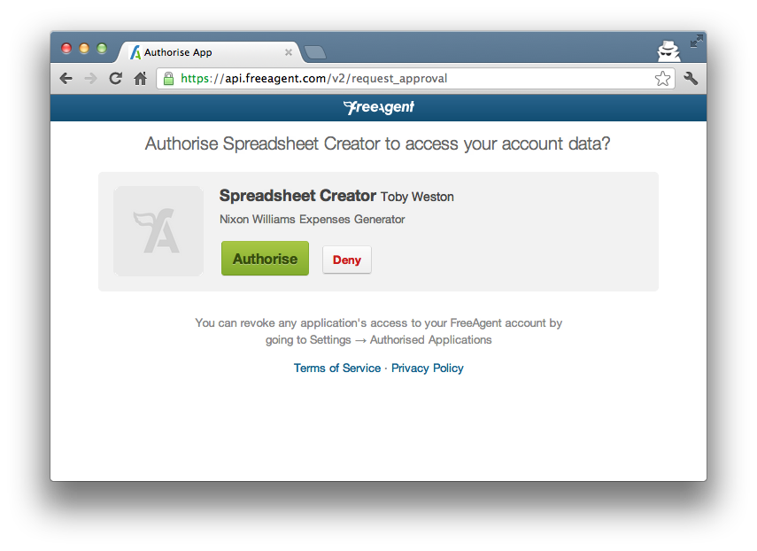

Although OAuth is intended for web, mobile and desktop applications, I've been finding the protocol clunky when accessing a web application from a rich desktop client. Specifically, I'm trying to access FreeAgent's API. Their [documentation is pretty thin](https://dev.freeagent.com/docs/oauth) on background. The [support](https://groups.google.com/forum/#!forum/freeagent_api) is fairly focused on web apps and I found it difficult getting a desktop client hooked up.

As a result, I'm journaling my experiences and hopefully learning a thing or two about OAuth along the way.


## OAuth

[OAuth](http://www.oauth.net) is described as "an open protocol to allow secure authorisation from web, mobile and desktop applications". It's intended as a handshaking protocol whereby an application is granted authorisation to another without having to know the target application's user credentials. The application requesting access never knows the end users details.

It's probably best described in terms of it's typical [workflow](http://hueniverse.com/oauth/guide/workflow/).


## Authorisation Request

Once you have an application _client id_ and _client secret_, you can request an _authorisation code_. This affectively means you're application is asking the target application for authorisation and to remember that your application is a valid "user". In API terms, it means you're asking for authorised access to the target's API.

A `GET` is made to the target _authorisation endpoint_ with the _client id_ and a _redirect URL_ in the query string.

``` shell
GET https://api.freeagent.com/v2/approve_app?redirect_uri=XXX&response_type=code&client_id=YYY HTTP/1.1
```

The [FreeAgent documentation](https://dev.freeagent.com/docs/oauth) talks about your application making this request but it really needs to be done in a browser environment. Fine, if your application is a web app. Not fine, if you're trying to programmatically do the HTTP `GET` request. At least, things got complicated for me when I tried.

If you do make the request in a browser environment, you'll log into FreeAgent with your user account and be asked to authorise the client application.



At this point, FreeAgent will redirect to the _redirect URL_ you supplied with the authorisation request. This is where it gets clunky. For a desktop application, where should you redirect to? The protocol causes tension because it requires a HTTP endpoint. Up and till now, it's only required a HTTP _client_, not a running _server_.

There is an "out of band" option in the OAuth specification. Using this, you would supply the query parameter `oauth_callback=oob` instead of a `redirect_url`. In this case, you'll be redirected to a page maintained by the target application (FreeAgent in our example) where the authorisation code is displayed for you to copy. Unfortunately, FreeAgent [don't support this](https://groups.google.com/forum/?fromgroups#!topic/freeagent_api/Rbld9sm0GOA) "out of band" option.

## Fake OOB

In lieu of this, I resorted to firing up a temporary HTTP server to reproduce the affect. The server runs on `localhost:8088/oauth` for example, and will extract the code from the response to the original authorisation request. If you set the `redirect_uri=http%3A%2F%2Flocalhost%3A8080%2Foauth`, the request will be redirected here after you've manually confirmed authorisation in the browser. Crucially, it will pass along the _authorisation code_ in the URL.

``` shell
http://localhost:8080/oauth?code=1A18cTY2tK7_ZHUsYSknCVWbVRYB4Nk
```

All that's left to do is extract it programmatically or display it for some cut and paste action. In my spoofed "out of band" workflow, it looks like this.


At this point, you're application is now authorised to access the target. Jumping into my FreeAgent account, I can see this to be the case. The FreeAgent documentation doesn't make it very clear when it says the next step happens "out of band", but once you've got your authorisation code, it'll be valid for a while. You don't need to go through this step every time your application uses the target API.


## Next Up

Once you've got the _authorisation code_ but before actually being able to access target resources, you need to exchange the code for an _access token_.

I think that's quiet enough for now though, so we'll take a look at how that's done in the [next post](/blog/2012-08-12-oauth-and-http-part-ii).

