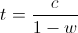

Working out the theoretical optimal number of threads you should use for your application is fairly straightforward. You do, however, need to understand your applications runtime characteristics. Is it mostly occupied with CPU intensive work or is it mostly waiting for IO?

In this post, we look at how to work out a good thread pool size for your CPU and IO based tasks.


## CPU Bound Tasks

For CPU bound tasks, Goetz (2002, 2006) recommends

```shell
threads = number of CPUs + 1
```

Which is intuitive as if a CPU is being kept busy, we can't do more work than the number of CPUs. Goetz purports that the additional CPU has been shown as an improvement over omitting it (2006), but others don't agree and suggest just the number of CPUs is optimal.


## IO Bound Tasks

Working out the optimal number for IO bound tasks is less obvious. During an IO bound task, a CPU will be left idle (waiting or blocking). This idle time can be better used in initiating another IO bound request.

Subramaniam (2011, p.31) describes the optimal number of threads in terms of the following formula.

```shell
threads = number of cores /  (1 – blocking coefficient)
```



And Goetz (2002) describes the optimal number of threads in terms of the following.

```shell
threads = number of cores * (1 + wait time / service time)
```


Where we can think of `wait time / service time` as a measure of how contended the task is.

## Goetz and Subramaniam Agree

Just out of interest, we can show that both IO bound formulas are equivalent. Starting with Goetz’s formula, we assert that `w+s=1` and remove the service time (`s`) giving the following


We can continue by multiplying both sides by `1-w` reducing the right hand side to `c` before reversing the operation and revealing Subramaniam’s expression.


This post originally appeared on my concurrency library [tempus-fugit](http://tempusfugitlibrary.org/)'s project site.

## References

- Goetz, B. 2002. [Java theory and practice: Thread pools and work queues](http://www.ibm.com/developerworks/java/library/j-jtp0730/index.html). IBM DeveloperWorks.
- Goetz, B. Peierls, T. Bloch, J. Bowbeer, J. Holmes, D. and Lea, D. 2006. [Java Concurrency in Practice](http://amzn.to/NrXQPZ). 1st Edition. Addison Wesley.
- Subramaniam, V. 2011. [Programming Concurrency on the JVM](http://amzn.to/NrXXuI). 1st Edition. Pragmatic Bookshelf.