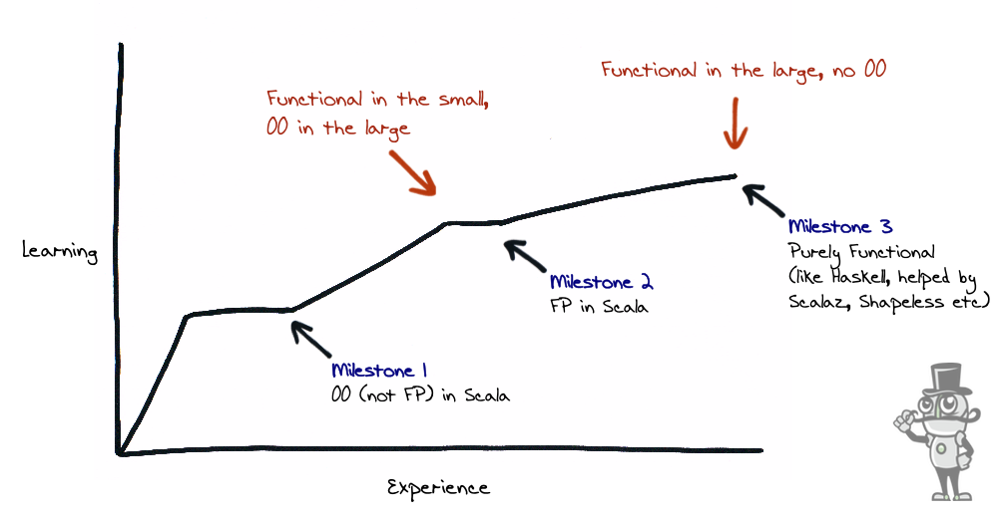
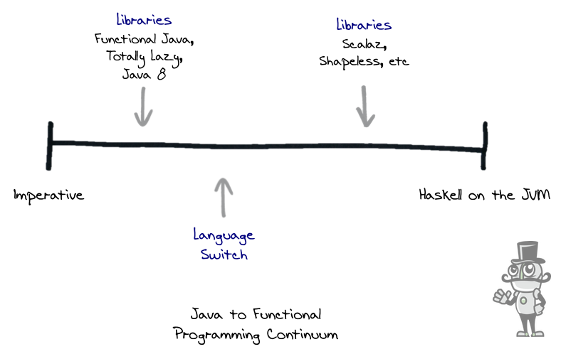

If you've just started to learn Scala and are wondering what to expect, it's typical to experience a quick ramp up in skill followed by a slower adoption of the more sophisticated features. In this post, I talk about what I think of as a typical learning curve.

Taken from my [Pluralsight](http://bit.ly/1DsYl9f) course, the chart shows experience (or time) along the `x` axis and some measure of "learning" on the `y`.

## Milestone 1

When you first start, you can expect getting up to speed with the language to be a fairly steep incline. That's not to say that it's difficult to get to the first plateau, so by "steep", I really mean "short"; you can expect a relatively quick increment in learning.

You'll probably sit here for a bit applying what you've learnt. I see this as the first milestone; to be able to build object-oriented or imperative applications using language specific constructs and features but without necessarily adopting functional programming. Just like learning any other language in the Java / C family.
    

## Milestone 2

I see the next milestone as adopting functional programming techniques. 

This is much more challenging and likely to be a shallower curve. Typically this will involve using traditional architecture design but implementing functional programming techniques in the small. You can think of this approach as ["functional in the small, OO in the large"](http://www.johndcook.com/blog/2009/03/23/functional-in-the-small-oo-in-the-large/). Starting to embrace a new functional way of thinking and unlearning some of the traditional techniques can be hard, hence the shallower incline.

Concrete examples here are more than just language syntax, so things like [higher order and pure functions](/blog/2012-04-03-scala-as-a-functional-oo-hybrid/), [referential transparency](http://en.wikipedia.org/wiki/Referential_transparency_\(computer_science\)), immutability and side effect free, more declarative coding; all the things that are typically offered by [pure](http://en.wikipedia.org/wiki/Pure_function) functional languages. **The key thing here is that they're applied in small, isolated areas.**

## Milestone 3

The next challenge is working towards a more cohesive functional design; this really means adopting a functional style at a system level; architecting the entire application as functions and abandoning the object-oriented style completely. So, aiming for something like a Haskell application.

All the concrete functional programming mechanisms above apply but this time, throughout the system; not to isolated areas but lifted to application-wide concerns. Picking up advanced libraries like [Scalaz](http://eed3si9n.com/learning-scalaz/index.html) seems to go hand-in-hand with this point of the curve.

## As a Continuum

You can also think of adoption as more of a continuum with traditional imperative programming on the left and pure functionally programming on the right.

You can think of the far right as Haskell on the JVM. Haskell is a pure functional language so you don't have any choice but to design your app in a functional way. Scala is an object-oriented / functional hybrid, it can only give you the tools. It can't enforce functional programming; you need discipline and experience in Scala to avoid mutating state for example. Haskell will physically stop you.

So as you start out on the continuum using Java and move to the right, libraries like [Functional Java](http://www.functionaljava.org/), [Totally Lazy](https://code.google.com/p/totallylazy/) and even [Java 8 features](https://leanpub.com/whatsnewjava8) help you adopt a more functional style. There comes a point where a language switch helps even more. Functional idioms become a **language feature** rather than a **library feature**. The syntactical sugar of for-comprehensions are a good example.

## Final Thoughts

Libraries like [Scalaz](http://eed3si9n.com/learning-scalaz/index.html) make it easier to develop a purely functional style. It's worth noting that reaching the far right of the continuum (or top right quadrant of the learning curve) doesn't have to be the goal. There are plenty of teams operating effectively across the continuum.

When you're adopting Scala, make a deliberate decision about where you want to be on the continuum, be clear about _why_ and use my learning curve as a way to gauge your progress.

I've developed a video course exclusively for [Pluralsight](http://bit.ly/1DsYl9f) to help Java teams make the transition to Scala. If you're interested and liked this post, [check it out](http://bit.ly/1DsYl9f) or read my book [Scala for Java Developers: A Practical Primer](http://amzn.eu/dcJRJ41).