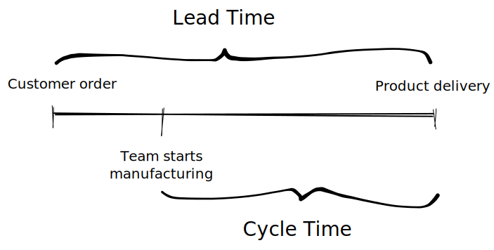
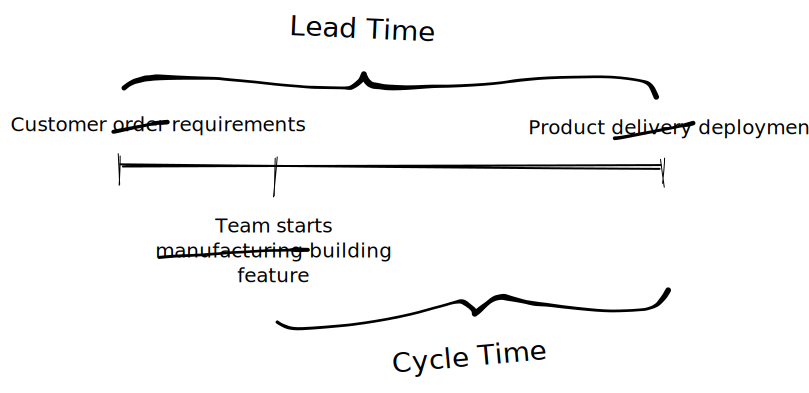
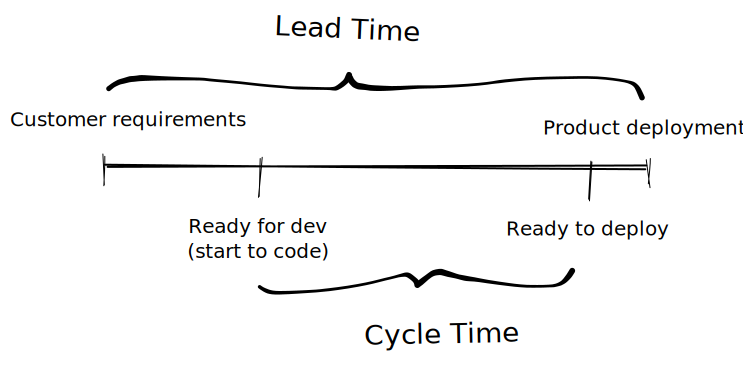
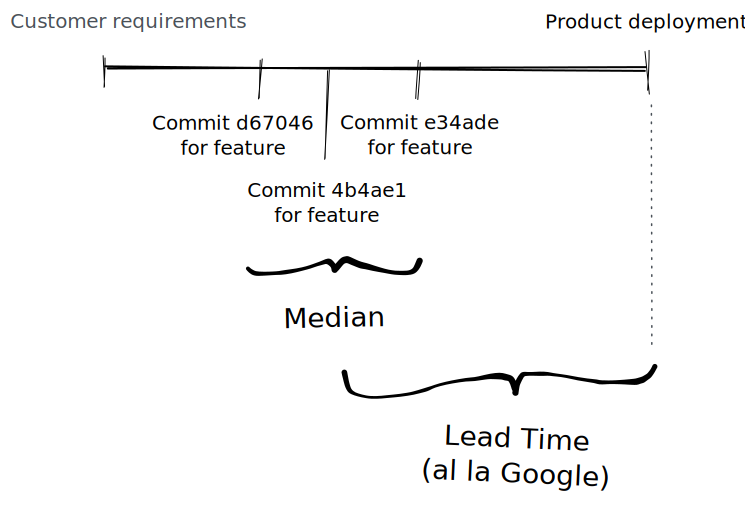

The terms _lead time_ and _cycle time_ are often conflated or used interchangeable when in fact there's a subtle distinction. It doesn't help that the terms stem from the manufacturing industry and don't translate directly to software delivery. With the advent of lean manufacturing and the more general adoption of "lean" in the software delivery space, the terms have become more relevant to software delivery. DORA and the [State of DevOps Report](https://services.google.com/fh/files/misc/state-of-devops-2021.pdf) use **Lead Time for Changes** as one of its four key metrics (and notably don't talk about _cycle time_) and so more and more organisations are becoming interested.

The basic premise is that if you are measuring the duration of manufacturing processes, you can attempt to optimise and use those measurements as feedback. If the duration goes down, you're doing something right. Manufacturing (specifically lean manufacturing) will focus on the _[theory of constraints](https://www.leanproduction.com/theory-of-constraints/)_ and elimination of _waste_ to optimise but any kind of experiment (where the hypothesis is an optimisation of the process) can be validated via this kind of measurement.

<!-- more -->

## Manufacturing

In manufacturing, _lead time_ measures the time between a customer order and order fulfilment. _Cycle time_ measures the time it takes for a team to manufacture the product and so by definition, is shorter than lead time.

**Lead Time** - Time between custom order and product delivery   
**Cycle Time** - Manufacturing time for a single unit. Always less than Lead time 

Lead time is customer focused. It measures the _arrival_ rate of products whereas cycle time measures the _actual_ rate of work. Cycle time directly affects lead time so companies can significantly reduce their lead time by more effectively managing their cycle time. This is super important for lean manufacturing or just in time manufacturing where a low cycle time means you can balance demand with _inventory_ (where "inventory" in the lean sense represents waste and should be avoided).

 
## Software Delivery

So how do we translate the manufacturing definition to software delivery?

The software analog of a customer order is the expression of requirements and the analog of fulfilment is delivery. So broadly speaking (1), the time from requirements gathering to releasing the implementation of that requirement to production.

**Lead Time** - Time between custom order requirements and product delivery deployment   
**Cycle Time** - Manufacturing time for a single unit feature. Always less than Lead time

Some subtlety can come in when we think of cycle time as a more general concept. That we can measure different types of activity or focus on subsets of the software lifecycle and still call it cycle time. The trick is to measure what makes sense for your context, start with the biggest bottleneck and have a deliberate goal to improve.

### An Example of Cycle Time

As an example, when my team started to feel that we were slowing down and spending more time on SDLC paperwork than building actual software, we started to measure what we called "cycle time".

This was the time it took for a feature to work it's way across our board. The time a feature was picked up for development until the time it was 'ready to release'. It didn't include requirements work or deployment time. In fact, because we ran iterative cycles, everything was batched for deployment at the end of the week. If we included that, our measurements would be skewed to include idle time (waiting for deployment). This was important because we actively ran an experiment to see if our cycle time would reduce if we extended our iterations from one week to two. We moved to the longer iteration and continued to measure. Our cycle time reduced because we spent less time on paperwork relative to story work in an iteration. The % time spent on paperwork was less relative to the length of the iteration - we had more time to work on features.

The important thing to note here is that we used our definition of cycle time to prove a hypothesis and once we were done, we stopped measuring.

## Google / DORA

The Google research and assessment programme around DevOps have lead to their conclusion that four (soon to be five) key performance indicators are associated with high performing organisations. They've demonstrated this correlation between four metrics: **Deployment Frequency**, **Lead Time for Changes**, **Mean Time to Recovery** and **Change Failure Rate** over ten years and several statistical surveys with 2,600 participants in 2021. They very clearly define the Lead Time for Change metric as follows.

> The amount of time it takes a commit to get into production - [Google](https://cloud.google.com/blog/products/devops-sre/using-the-four-keys-to-measure-your-devops-performance)

They go on to say... 

> Lead Time to Change metric requires two important pieces of data: when the commit happened, and when the deployment happened. This means that for every deployment, you need to maintain a list of all the changes included in the deployment. This is easily done by using triggers with a SHA mapping back to the commits. With the list of changes in the deploy table, you can join back to the changes table to get the timestamps, and then calculate the median lead time 
> — <cite>Google</cite>

### How to Measure DORA's Lead Time

Google have stated a general approach above but I think it's not immediately obvious where you'd start. Lead time should be recorded per _unit_ in manufacturing parlance which basically means per _feature_ when translated to software delivery. **That means we need a way to link commit(s) to a unit or feature**. In diagram form, you can see below that the Google definition is describing what we called _cycle time_ in the Software Delivery section above. That's ok, we can think of this as moving bounded contexts (in the [Eric Evan's sense](https://martinfowler.com/bliki/BoundedContext.html)) but it might be helpful to be explicit and use Google's full term: Lead Time **for Change** (where the "for change" postfix distances the definition from plain old _lead time_).

Fortunately, we can derive timestamp information from individual commits via Git (and/or a Git client libraries) and by insisting on Git commit messages including a JIRA number, we can group by feature. We can derive the median from this group of dates and start the stop watch. Ensuring the commit message includes a JIRA number can be achieved with a {
[pre-commit hook](https://www.atlassian.com/git/tutorials/git-hooks) and regex pattern or we could leave these as "untrackable". If you're brave enough, you could even [derive the JIRA number from the branch name](https://stackoverflow.com/questions/48170832/pre-commit-hook-to-check-for-jira-issue-key) (although I can't recommend that!).

> Lead Time for Change should be measured per feature or story which means linking commits to something like a JIRA task/story/feature/[insert preferred term here]

To stop the clock, we need a way to understand when the feature is deployed.

As we have the JIRA numbers associated with the commits, we can use JIRA APIs to collect meta-data about the features. For example, against a JIRA, we could retrieve fix version and target date (for the release of that fix version). Alternatively, we could simulate the cycle time example above by using a state transition to something like "ready for deployment". This might be more fine grained but in order to scale across wider organisations, it would mean consistent use of JIRA across (for example, for everyone to have a 'ready for deployment' state) which would be a challenge. Far better to use the cruder but universally applicable standard fields.

> Using something like JIRA's releases and fix versions to estimate a target deployment date and linking via commit messages would give a fairly accurate and scalable implementation of Lead Time for Change

The obvious problem here is that JIRA is only speculating about the release date so there's potentially a data quality issue. I think it's a reasonable balance though between easy measurement and being pragmatic about scaling across the org. Grouping features (JIRAs) by release and then retrieving data about the physical release (via deployment tooling) is much harder (not least because of disparate mechanisms of deployment). Interestingly, there's a sedgeway there to the notion of recording SDLC events consistently regardless of the source of those events. With this approach, we can consistently capture actual release dates and provide the linkage between commits, features and deployment. That's another challange all together though and a story for another day...

(1) There's some ambiguity in the statement around 'expression of requirements' but for arguments sake, lets assume we mean the point in time where a requirement is documented and acceptance criteria defined.