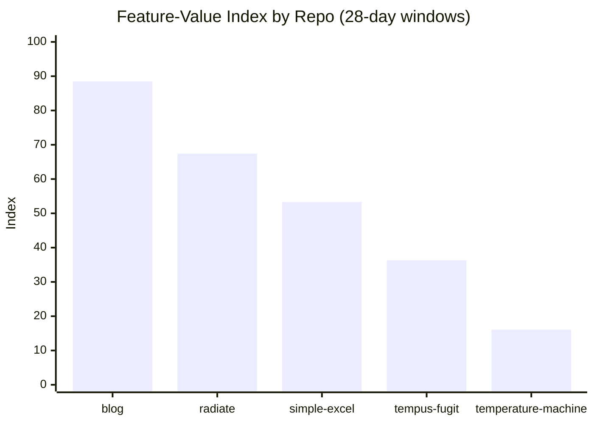
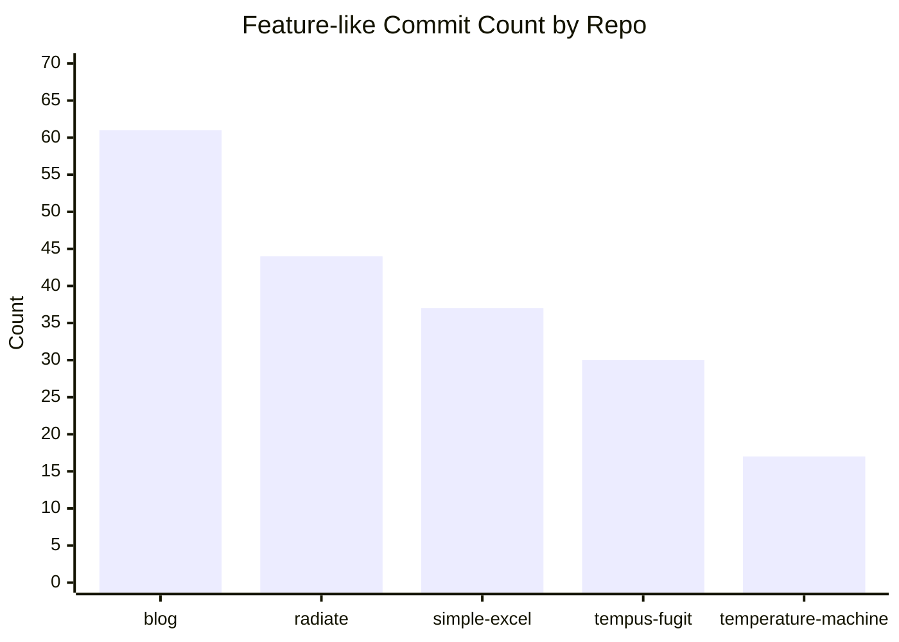
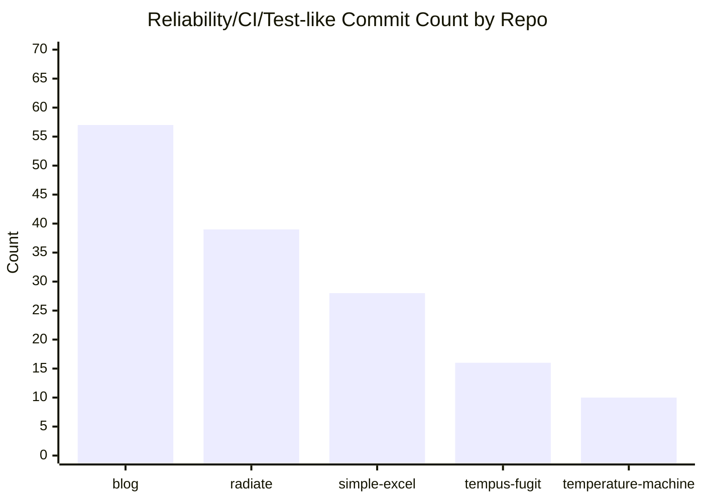
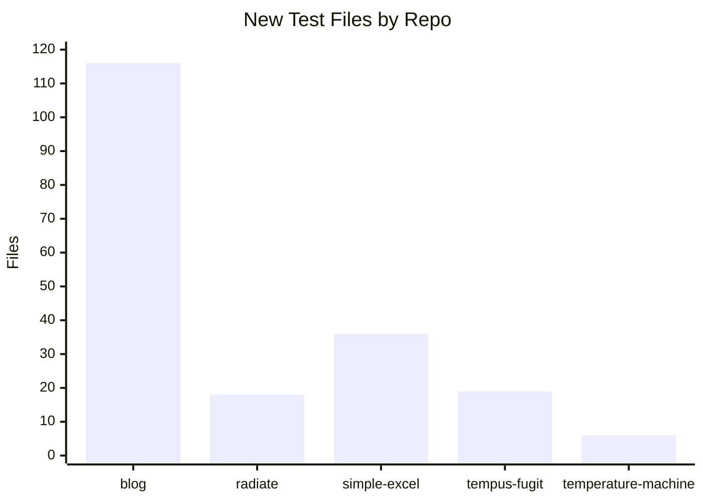
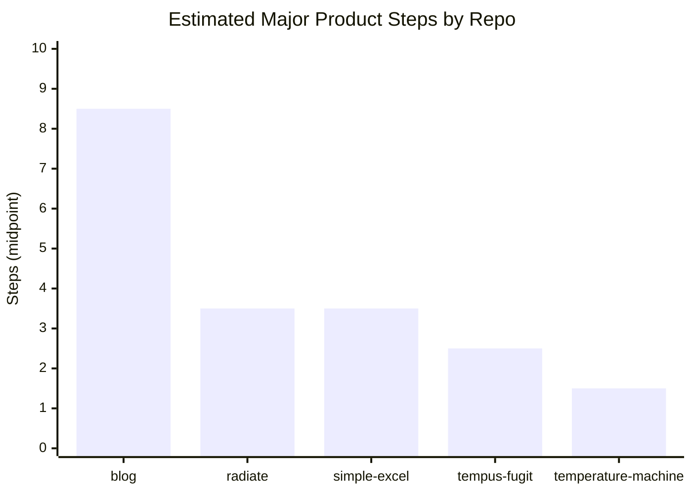
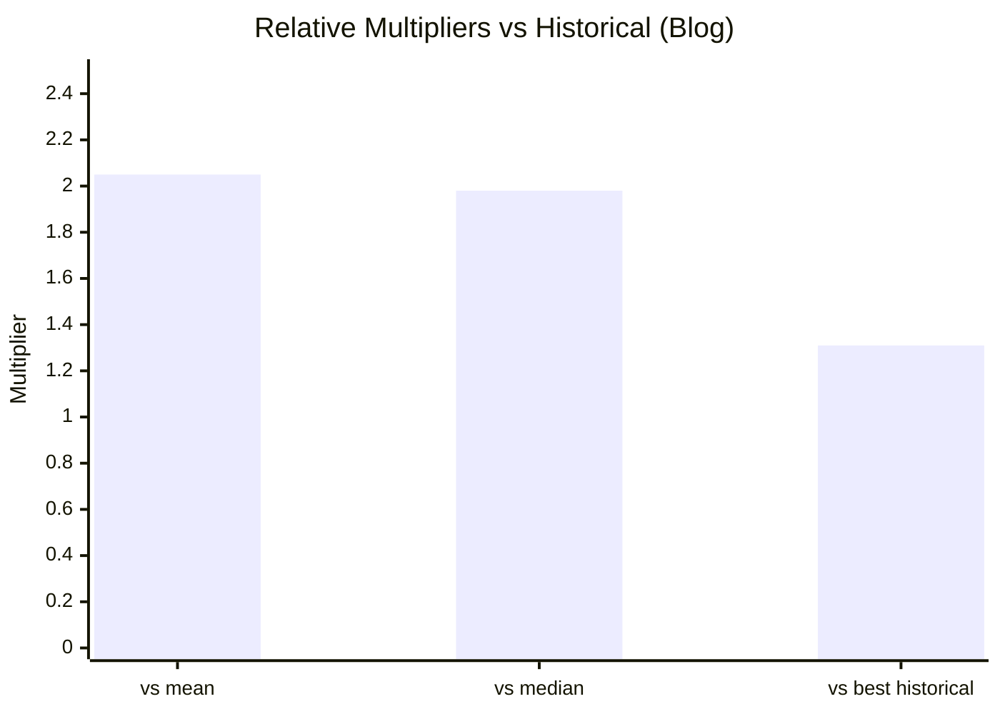

Recently, I shipped an AI RAG Ghostwriter system plus CI, unit and visual tests for my blog, oh and migrated from Ruby (Octopress) to Astro static site generators. Something that I gave up doing manually about a year and a half aog.

It felt insanely productive. That initial migration I gave up on (moving one post at a time, converting one at a time) took me about a day, elapsed time. About 200 posts plus glue and custom processing.

Afterward, I was curious if that feeling of productivity was real, and if so, how much faster I was compared to my own historical peaks. So I set out to find out.

> Turns out, I've been ~2.8x more productive that my historical peaks

Here’s the story.

## The Question

Did AI meaningfully increase my throughput over a concentrated four‑week window, compared to my own past peak periods?

Not lines of code but something more meaningful - delivered features and value-add.

## How I Measured

I wanted to measure initiatives and value, not commits or lines of code.

Some that's a discrete, user‑meaningful chunk of work that stands alone in production. An example might be adding a Cypress suite of visual regression tests rather than fixing a flaky test. Let's call this an **initiative**.

### 1. Initiative Sizing

Each initiative got a `FeatureValueIndex` (FVI) on four dimensions: new features, new misc code, new tests, and reliability (hardening, CI, general scaffolding). The idea being group code changes and bias towards "features" or value-add. To avoid raw-LOC bias, each was weighted.

> `FVI = (0.45 * feature) + (0.25 * new_code) + (0.20 * new_tests) + (0.10 * reliability)`

...where each component is normalized to the maximum observed across compared repos.

### 2. Commit‑bucket Heuristics

To work out which commits contributed to which dimension, I applied semantic reasoning based on commit message and actual code (diff). I should add that AI did the heaving lifting here.

Buckets let me infer where the code actually contributed. Crude, but directionally useful.

### 3. Comparable Windows

I compared the recent 28 days to four historic one‑month “peak” windows where I worked hands‑on and shipped meaningful platform work.

No “10x developer” nonsense. Just like‑for‑like, same engineer, just younger.

During this time, the historical-me was passionate about code craft and quality. I would labor design decisions and build complex systems that would be low maintenance and high quality. I would write tests first, relentlessly focus on refactoring and good object-oriented (or functional-esq design).

Recent me is much more "vibe" coding. I've focused a lot on organisational leadership in my more-recent career, running a large team and setting the same standards at the org level that I was practicing passionately in these historical peak periods.

## Case Study: The Recent AI‑Assisted Burst

The headline deliverables for my recent AI assisted burst were:

- Implementing a full RAG-based Ghostwriter pipeline that drafts long‑form content in my voice via OpenAI
- CI that evaluates drafts using style checks, broken‑link scans, and content linting.
- Visual regression tests on the rendered site to catch layout drift before publish.
- Lightweight RAG index (FAISS) over past posts and a style profile to ground the drafts.
- Reproducible prompts, fixtures, and an evaluation harness that blocks merges if scores regress.

### How I actually worked

- I wrote crisp task briefs with constraints and acceptance checks
- The model produced first drafts and scaffolding
- I refactored for naming, boundaries, and failure modes
- I asked the model to write tests from the acceptance checks, then I improved them
- I froze good prompts, recorded fixtures, and added them to the evaluation harness
- I iterated until evaluation gates were green on repeat runs

The AI approach was great at breadth and speed. My time went on shaping, joining, hardening and waiting around for multiple prompt-threads to complete.

## Historical Comparators

I compared against four earlier one‑month peaks:

| Repo                  | Window                       |
|-----------------------|------------------------------|
| `blog`                | `2026-02-08` to `2026-03-07` |
| `simple-excel`        | `2012-08-25` to `2012-09-21` |
| `tempus-fugit`        | `2009-11-30` to `2009-12-27` |
| `temperature-machine` | `2018-04-12` to `2018-05-09` |
| `radiate`             | `2013-07-24` to `2013-08-20` |

Why these? From trawling the commits, GitHub stars and activity on my projects, these were some of my best and busiest projects and months I was “on it.”

### Raw Delivery Signals

| Repo                  | Commits | New Files | New Code Files | New Test Files | Feature-like Commits | Fix-like Commits | Reliability/CI/test Commits |
|-----------------------|--------:|---------------:|--------------------:|--------------------:|--------------------------:|----------------------:|---------------------------------:|
| `blog`                |     196 |            225 |                  52 |                 116 |                        61 |                    51 |                               57 |
| `simple-excel`        |     105 |             78 |                  57 |                  36 |                        37 |                    25 |                               28 |
| `tempus-fugit`        |      76 |             40 |                  31 |                  19 |                        30 |                     9 |                               16 |
| `temperature-machine` |     126 |             25 |                   3 |                   6 |                        17 |                    10 |                               10 |
| `radiate`             |     146 |            125 |                  96 |                  18 |                        44 |                    26 |                               39 |

### Headline numbers (FVI totals for the month)

| Repo                  | FeatureValueIndex |
|-----------------------|------------------:|
| `blog`                |          **88.5** |
| `radiate`             |              67.4 |
| `simple-excel`        |              53.3 |
| `tempus-fugit`        |              36.3 |
| `temperature-machine` |              16.1 |

### Relative Multipliers (Recent `blog` vs historical)

- vs historical mean: **2.05x**
- vs historical median: **1.98x**
- vs best historical window (`radiate`): **1.31x**

The AI-driven burst moved more first‑mile code than I typically would in a month. The last‑mile and the guardrails were still mine.

## Coarse-Grained Product Steps (Qualitative Read)

Estimated count of major capability steps shipped in each window:

| Repo                  | Major Steps (estimated) | Examples                                                                                                                                                                                  |
|-----------------------|------------------------:|-------------------------------------------------------------------------------------------------------------------------------------------------------------------------------------------|
| `blog`                |                 **8-9** | Ghostwriter end-to-end flow, semantic RAG/indexing, CLI, dedicated Python CI/tests, visual-regression hardening, routing/canonical redirects, archive/search UX, SEO+discussion+analytics |
| `simple-excel`        |                     3-4 | API shaping, styling support maturation, release hardening                                                                                                                                |
| `tempus-fugit`        |                     2-3 | concurrency/deadlock capabilities plus docs/site packaging                                                                                                                                |
| `radiate`             |                     3-4 | exception/info display architecture, event/logging behavior, UI feature controls                                                                                                          |
| `temperature-machine` |                     1-2 | packaging/install/deployment stabilization with limited net-new core features                                                                                                             |

## Charts

## Findings

1. Recent `blog` activity is not just higher churn; it combines feature construction, reliability scaffolding, and productization in one window.
2. On feature/value proxies, recent `blog` work is about **2x** your typical historic peak OSS window and still about **1.3x** above your strongest historical comparator.
3. The largest AI-era gain appears to be **parallelized delivery**: building net-new subsystem capability while simultaneously tightening tests/CI and docs.

## What The Numbers Reveal (and Hide)

What they reveal

- Initiative throughput went up materially. More finished, production‑ready slices in the same wall‑clock time.
- Breadth is where the model shines. Boilerplate, adapters, and “you already know how this looks” scaffolds arrived quickly.
- Hardening stayed the multiplier. Tests, CI, reproducible evaluation, and visual diffs converted drafts into delivery.

What they hide

- Quality variance. First drafts were right‑shaped but occasionally wrong‑headed. My review loop collapsed that, but it took time.
- Brittleness risk. Prompt drift is a thing. Frozen prompts and recorded fixtures mattered more than I expected.
- Governance overhead. Tracking prompts, evaluation data, and model versions adds operational cost. Worth it, but it’s a cost.
- Dependency gravity. You inherit changelogs from SDKs, tokenisers, and image libs. Keep them boring and pinned.

What changed in my behaviour

- I wrote tighter briefs and constraints than I would for myself. That paid back twice: faster drafts and clearer tests.
- I reviewed more, typed less. Review becomes the design surface.
- I invested earlier in evaluation and fixtures. It felt slow on day two and fast on day ten.

Experience matters

- An experienced engineer plus AI is not equivalent to a junior plus AI.
- The risk surface is different: you need taste for boundaries, failure modes, and what “clean enough” looks like.

## Man vs the Model?

Across a month, my AI‑assisted self out‑shipped my historical peaks by ~2.7–2.8x on an initiative‑weighted basis.

That advantage existed because I paired generation with hardening and governance. Without tests, CI, and reproducible evaluation, you get speed without confidence, which is just future work with interest.

It didn’t replace expertise. It amplified it, especially on repeatable patterns and breadth tasks.

## Recommendations

If you want to run the same experiment, consider this:

- Measure at the initiative level. Amplify the things you value, in my case, I weighted rigour/testing at 2x
- Keep a prompt and fixture repo. Version everything. Treat prompts as code
- Freeze good prompts and record fixtures the moment a result is “good”
- Keep a drift budget. When evaluation scores wobble, fix prompts/fixtures first; only then refactor code
- Don’t count LOC. Track something finished initiatives, FVI

## Over to you...

What did AI actually add to your last month?

If you’ve measured at the initiative level, I’d love to hear your experience, where it helped, and where it got in the way. If you haven’t, pick your next two initiatives, measure, and tell me what you see.
