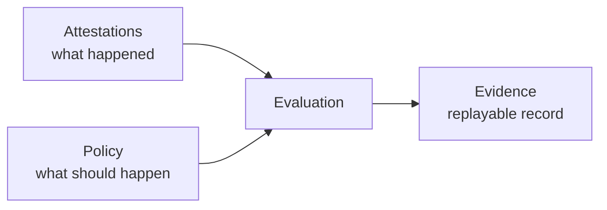

import ExampleCallout from '../../components/ui/ExampleCallout.astro';

To manage risk, first line teams will typically have to prove a control was applied (and presumably protected us from some risk). It's common that an auditor would ask for "evidence" and for the most part, they will look in some sort of compliance database (aka Compliance System of Record) for that evidence. More often than not, that's ServiceNow.

> Auditors look for evidence retrospectively to understand if a control was executed and is effective

The problem is that most of the time, the evidence doesn't have any context. It's the output of some process with no advocacy how it was produced or what policy or process it actually followed.

## Evidence != Proof

If you want to check I traveled to Brighton, you could look at my train ticket but you'd have no way to know if I actually traveled. If you have actual proof, perhaps CCTV footage of me boarding and departing the train, you wouldn't actually need the ticket stub. The ticket stub is evidence, but it doesn't prove I traveled. The CCTV footage is proof.

In modern governance systems, if we demonstrate the control can not be avoided (e.g. show a sealed pipeline is the only way to achieve an action), then we don't need to rely on the output so much. Audit the _system_, not the output.

## Attestations

Attestations in the general English sense have been a way for teams to "evidence" that they have done something (like met a control standard). We're used a human saying "I attest" or "I approve" and use it as evidence in the way it was described above. Audit functions rightly point out the waeknesses to this in the risk world - we can't rely on the human. So "attestation" becomes a nuaghty word in the GRC world and first line teams strive for more automation.

However, attestations as a term can take on a much stronger meaning when we look at SLSA and modern Governance Engineering. In this context, an attestation is much more formal.

> Attestations are **trusted** and **verifiable** statements or metadata about a **software arrefact** or group of artefacts. These statements help us asnwer important compliance questions.

Attestations are observations made against events. They are opinionless. They are just statements that something happened, usually against some form of artifact. For example, the **code** was _compiled_. They capture metadata about the evnt, for example, the version of the compiler used but they do not determin compliance. Attestations provide inputs needed to evalute compliance later. To be able to evalute them, you need to know the **policy**. Together this can form a cohierent set of steps to implement a contro.

To continue the example, we might have a policy which says only version 1.2 or above of the compiler is allowed. We record what version was used at the point of compilation and they later feed the policy that metadata to decide if we are compliant or not.

Key points:

* Attestation are facts
* Attestations are Opinionless, they declare something has happened and don't care what impact that has on compliance
* Attestations are distinct from governance, they must be applied to policy to derive compliance

<ExampleCallout mascotAlt="Illustration of a chef giving a thumbs up">
As an example, a Baker making cakes in a bakery might attest to the ingredients used, the baking time and temperature, and any decorations added. This attestation provides a verifiable record of how the cake was made, which can be important for quality control and customer satisfaction.
</ExampleCallout>

## Policy

When we ask if a control is compliance (passes or fails our governance tests), we are _evaluating_ the control. We need to have enough information from teh attestations in order to do that. Simplisitically is result of evaluation is always pass or fail.

The way we capture the governance tests that must pass or fail, is in the **policy**. It's just a set of rules that define what is considered compliant or non-compliant. It takes the attestations as input and applies the rules to determine if the control meets the required standards. Rego is an expression language that allows us to write these rules in a structured and machine-readable way which really means we can write _policy-as-code_. When we evalute a rego policy, we pass in attestations and get a compliance status back.

Key points:

* Evaluations consume attestations, they do not alter them (an evaluation itself however, might produce new attestations)
* Because attestations are artifact-bound, evaluations are made against a specific artefact or group of artefacts
* Evaluations are always either a pass (compliant) or fail (non-compliant)

The point around artifact-binding is interesting. It means evaluations prove something is true for a given artefact and that is a powerful tool when we want to demonstrate _provenance_ of artefacts, especially to a chain of compliance statements.

<ExampleCallout mascotAlt="Illustration of a chef giving a thumbs up">
The Baker must ensure her cakes are nut or allergen free, she might put a procedure or control in place to check the ingredient list before shipping or even employ a third party to verify the ingredient list. If the verification comes back with no nuts or allergens, the evaluation against the control has passed. She is writing a set of policies.
</ExampleCallout>

## Evidence

Given the above, _evidence_ is the supporting documents or materials which summarise the evaluation of policy. It should be the information that helps a person or system evaluate whether a claim is true. The issue I pointed out earlier is that in many governance systems, the evidence often doesn't proof the claim. By building evidence that includes inputs, specific policy (think versioned) and the result of the evaluation, we can provide a more complete picture. Evidence like this captures the state of the system at a specific point in time, making the process becomes transparent rather than opaque. That means evidence can be replayed to easily and independently verify. Honestly, this is what auditors never knew they needed.

<ExampleCallout mascotAlt="Illustration of a chef giving a thumbs up">
A written statement of compliance showing the list of ingredients and the list of allergens, signed by the Baker (or third party), would be an example of evidence. It can be used to re-check the evaluation and would likely be stored for future inspection (for example, if the food inspector pays a visit).
</ExampleCallout>

## Pulling it together

**Attestations** record what happened. **Policy** defines what should have happened. **Evaluation** compares the two. **Evidence** is the durable record of that comparison, its really a side effect. It has the inputs, the versioned policy and the result, bound to a specific artifact and point in time.

Which brings us back to the auditor and the compliance database. The problem was never that there's too little evidence, it's that what's there arrives with no account of how it was produced. A ticket stub, not CCTV.

Get the chain right and nobody has to argue about the output, because anyone can replay the decision and get the same answer. Audit the _system_, not the output.