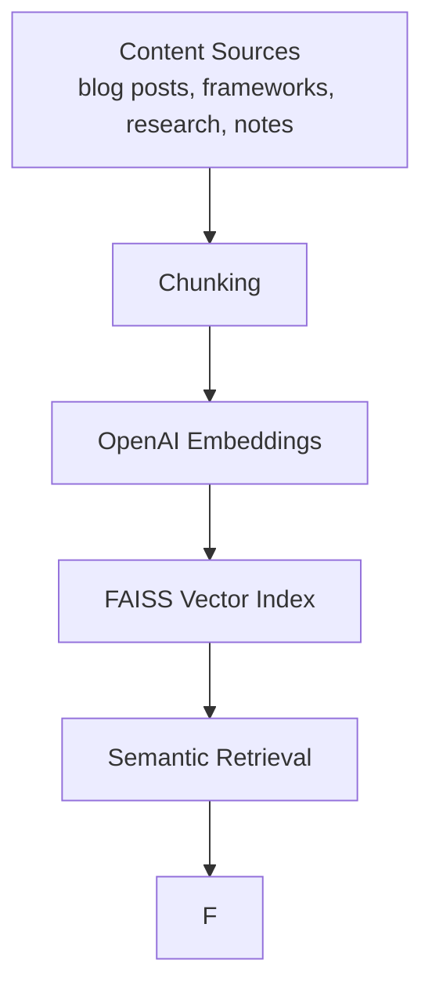
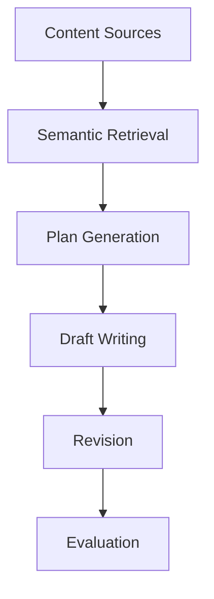

# Ghostwriter CLI

This CLI orchestrates the full blog-writing pipeline:

```
plan → review → draft → revise → evaluate
```

It is intentionally **guided and verbose** so you don’t have to remember the workflow.

Ghostwriter is designed as a **personal writing engine** rather than a single AI prompt.
It combines planning, semantic retrieval, structured frameworks, and revision passes to produce high-quality technical writing in your voice.


# Core Command

Create a new post:

```
python ghostwriter.py new "Your blog topic"
```

Example:

```
python ghostwriter.py new "Why compliance fails developers"
```

Pipeline:

1. Create a plan
2. Pause for human review
3. Generate a draft
4. Optional revision pass
5. Optional evaluation


# Typical Workflow

```
python ghostwriter.py new "Code review as an evidence system"
```

You will be prompted to:

1. Review the generated plan
2. Confirm drafting
3. Optionally revise
4. Optionally evaluate

This keeps **human judgement in the loop**.

The **plan stage is critical** — it determines the structure and argument of the post.


# Providing More Direction

Add an **angle** or thesis:

```
python ghostwriter.py new "Code review as an evidence system" --angle "code review is actually an assurance mechanism"
```

Add quick notes for the planner:

```
--notes "Frame around trust and evidence"
```

These hints guide the **planning phase**, which determines the argument and structure of the article.


# Using Research Documents

Provide specific research files:

```
python ghostwriter.py new \
"Trust in software delivery" \
--research research/common/dora-metrics.md
```

Multiple files (space-separated, tab-completion friendly):

```
--research file1.md file2.md file3.md
```

Comma-separated also accepted:

```
--research file1.md,file2.md,file3.md
```

If no explicit research is supplied, Ghostwriter will automatically search:

```
research/common
research/posts/<topic-slug>
```


# Using Notes

Provide structured notes:

```
python ghostwriter.py new \
"Trust in software delivery" \
--notes-file notes/posts/trust-in-software-delivery/outline.md
```

Multiple (space-separated, tab-completion friendly):

```
--notes-file file1.md file2.md
```

Comma-separated also accepted:

```
--notes-file file1.md,file2.md
```

Notes are intended for:

* outlines
* rough ideas
* argument fragments
* reminders


# Automatic Mode

Run without interactive prompts:

```
python ghostwriter.py new "Topic" --auto
```


# Automatic Revision

Run a revision pass automatically:

```
python ghostwriter.py new \
"Topic" \
--auto \
--auto-revision \
--revision-mode tighten
```

Revision modes:

```
tighten
stronger-hook
more-like-me
less-tutorial
more-opinionated
add-framework
sharpen-argument
```

See **REVISIONS.md** for details on each mode.

Revision passes are **targeted editorial improvements**, not full rewrites.


# Rebuilding the Semantic Index

Ghostwriter uses **semantic retrieval** to ground writing in existing content.

Run this when content changes:

```
python ghostwriter.py reindex
```

This rebuilds the vector index from:

```
blog corpus
frameworks
research
notes
```

Under the hood this runs:

```
python build_index.py
```

which creates:

```
cache/faiss.index
cache/chunk_meta.json
cache/chunks.jsonl
```

These files form the **semantic memory** of the system.


# Folder Structure

The CLI expects this structure:

```
ghostwriter/

frameworks/

research/
  common/
  posts/<slug>/

notes/
  common/
  posts/<slug>/

output/
  plans/
  drafts/

cache/
```


# Frameworks

Frameworks provide reusable **argument structures** and mental models for posts.

Examples include:

```
delivery-vs-runtime-risk
trust-lifecycle
supply-chain-vs-operational-risk
```

Framework files live in:

```
frameworks/
```

They contain structured metadata such as:

```
topics
when_to_use
key_claims
argument_patterns
example_phrasing
guardrails
```

During planning, Ghostwriter may select relevant frameworks to organise the article.


# Research & Notes Scoping

Automatic retrieval searches:

```
research/common
research/posts/<topic-slug>

notes/common
notes/posts/<topic-slug>
```

You can override this with:

```
--research
--notes-file
```


# Semantic Retrieval

Ghostwriter uses **semantic vector retrieval** to ground planning and drafting.

The retrieval pipeline is:



This allows Ghostwriter to retrieve relevant ideas even when wording differs.


# Recommended Alias

Add a shell alias:

```
alias gw="python /path/to/blog/ghostwriter/ghostwriter.py"
```

Then run:

```
gw new "Topic"
gw reindex
```


# When to Rebuild the Index

Run:

```
gw reindex
```

after adding or editing:

* blog posts
* frameworks
* research documents
* notes


# Mental Model



Think of it as a **personal writing engine**, not just a prompt.


# Best Practice

Always review the **plan** before drafting.

The plan determines:

* argument
* structure
* framework
* examples

If the plan is weak, the draft will be weak.


# Philosophy

The system is designed to:

* keep humans in control
* use retrieval instead of hallucination
* enforce clear argument structure
* maintain your writing voice
* encourage deliberate editorial revision rather than rewrites
