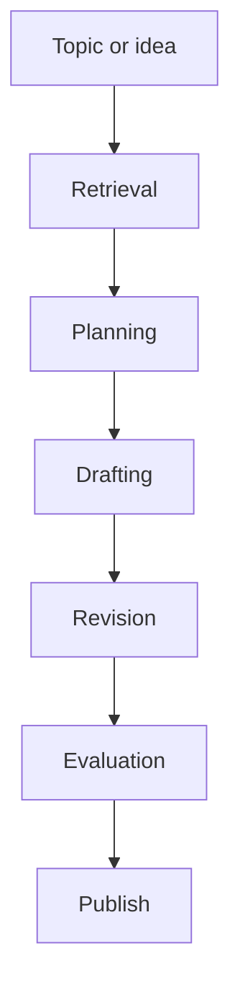
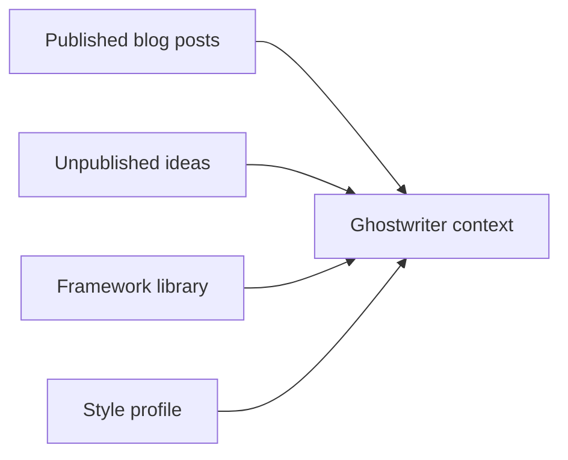
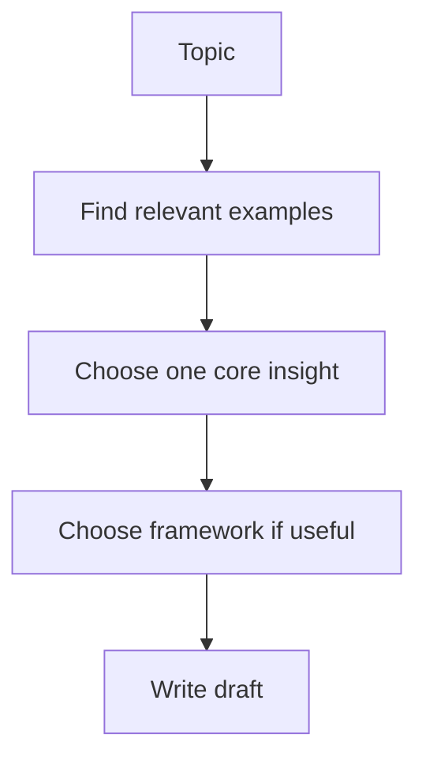
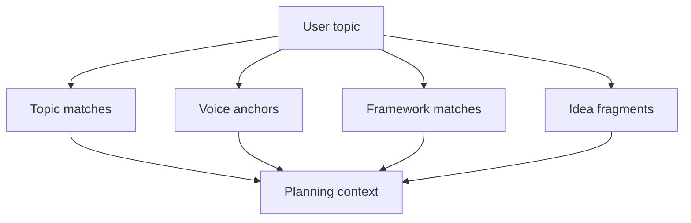
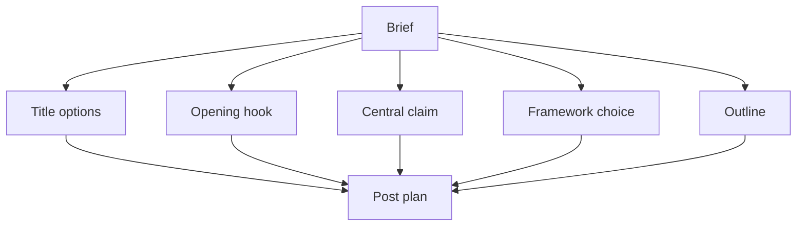
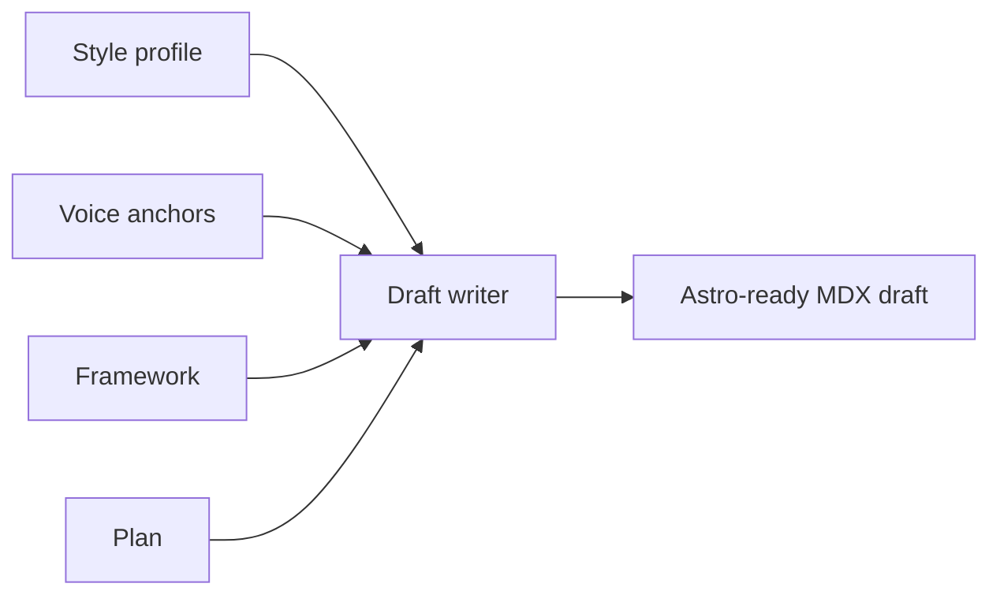
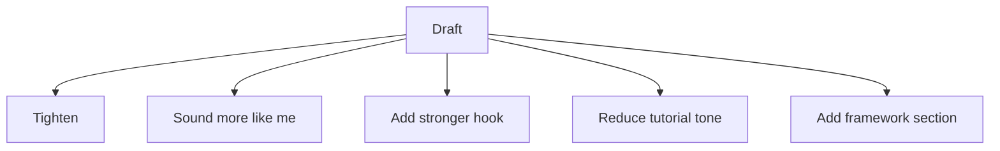
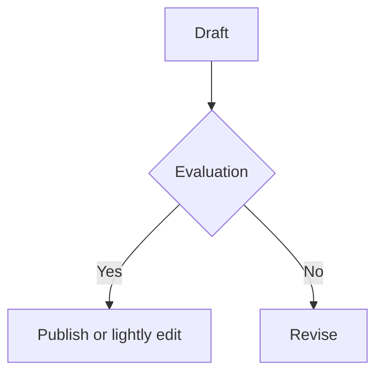
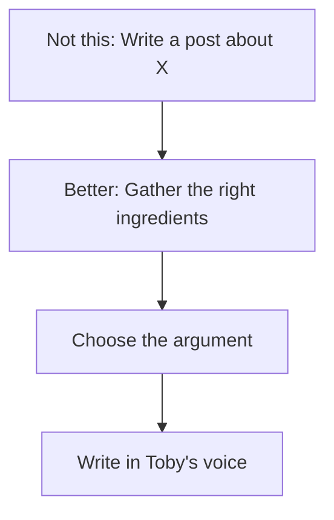

# Elite Ghostwriter — Instructions

This is the minimum mental model for the ghostwriter system.

## What this is

The system is not just a post generator.

It should work like this:

1. gather the right source material
2. decide the argument
3. write in my voice
4. revise intentionally

**Do not jump straight from topic to article.**

## Core architecture

### What each stage does

* **Retrieval** finds the right source material.
* **Planning** chooses the central argument.
* **Drafting** writes the post in the right voice.
* **Revision** improves a specific draft deliberately.
* **Evaluation** checks whether it sounds like Toby and is worth publishing.

## The 4 knowledge sources

Only the most important inputs matter:

* **Published posts** = source of truth for voice
* **Unpublished ideas** = optional supporting material
* **Frameworks** = reusable thinking models
* **Style profile** = voice rules and guardrails

## The most important rule

Every post should revolve around **one central idea**.

Secondary ideas may support it, but the draft should always resolve back to a single takeaway.

## Retrieval model

Do not retrieve only “similar posts”. Retrieve from different buckets.

Use:

* **Topic matches** for subject relevance
* **Voice anchors** for style consistency
* **Framework matches** for Toby's thinking patterns
* **Idea fragments** for rough but useful sparks

## Planning model

Planning is where quality starts.

A plan should decide:

* what the post is really saying
* why it matters
* what framework to use, if any
* how the argument will unfold

## Drafting model

The drafting layer combines curated inputs.

The draft should be based on:

* **style profile** for voice
* **voice anchors** for texture
* **framework** for thinking structure
* **plan** for argument and flow

## Revision model

Do not keep regenerating from scratch.

Revise with intent.

Typical revision modes:

* tighten
* stronger hook
* more opinionated
* more in Toby's voice
* less generic
* less tutorial

## Evaluation model

Before publishing, check the draft against a small rubric.

Minimum evaluation questions:

* Does it sound like Toby?
* Is there one clear central idea?
* Is it too generic?
* Is it too promotional?
* Is it publishable after a light edit?

## What the machine is really doing

This is the whole point:

The system should feel like a **writing assistant that understands how Toby thinks**, not just a text generator.

## Recommended build order

1. **Corpus + style profile**
2. **Framework library**
3. **Planner**
4. **Draft writer**
5. **Revision tools**
6. **Evaluation**
7. **Better retrieval / embeddings later**

## Short operating checklist

When using the system, remember this sequence:

1. Start with a **topic or rough idea**.
2. Retrieve **topic matches + voice anchors + framework**.
3. Create a **plan first**.
4. Draft from the plan.
5. Revise intentionally.
6. Evaluate before publishing.

If quality drops, the usual cause is one of these:

* weak retrieval
* no clear central insight
* framework missing or misused
* too much generation, not enough planning
