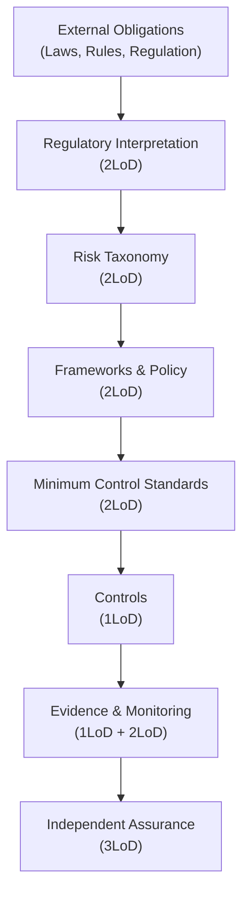

```mermaid
flowchart TD

A["External Obligations<br/>(Laws, Rules, Regulation)"]

B["Regulatory Interpretation<br/>(2LoD)"]

C["Risk Taxonomy<br/>(2LoD)"]

D["Frameworks & Policy<br/>(2LoD)"]

E["Minimum Control Standards<br/>(2LoD)"]

F["Controls<br/>(1LoD)"]

G["Evidence & Monitoring<br/>(1LoD + 2LoD)"]

H["Independent Assurance<br/>(3LoD)"]

A --> B
B --> C
C --> D
D --> E
E --> F
F --> G
G --> H
```