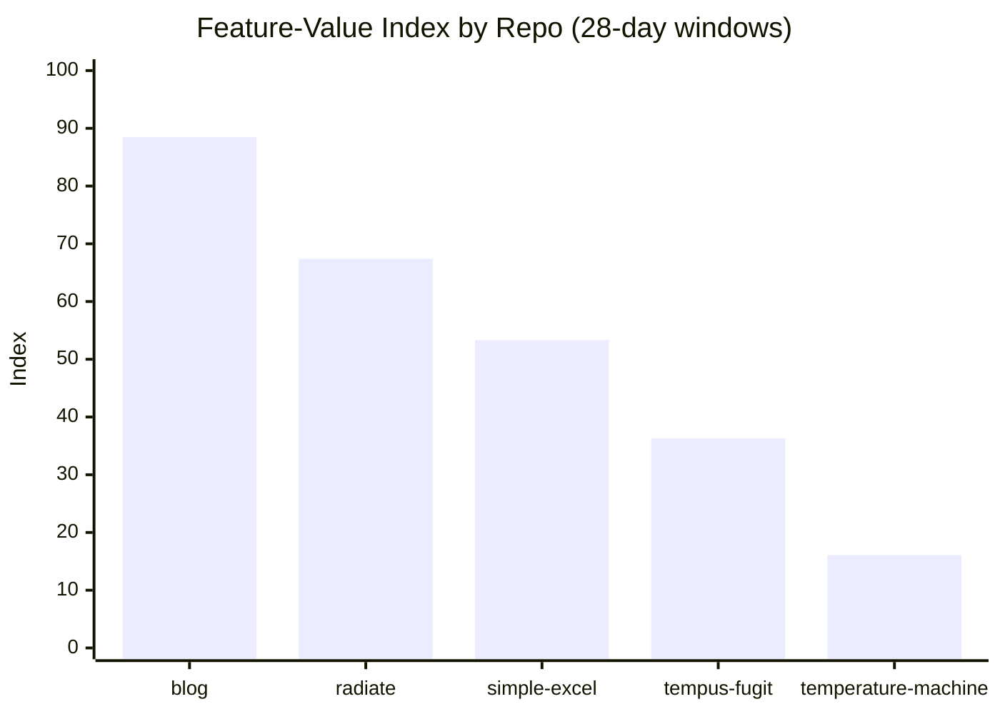
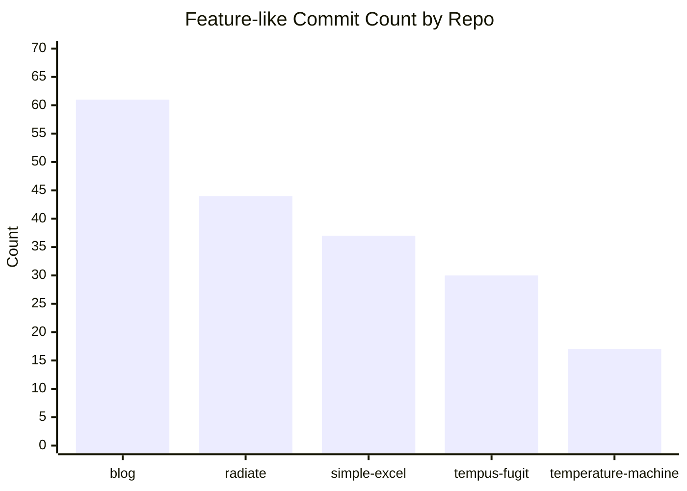
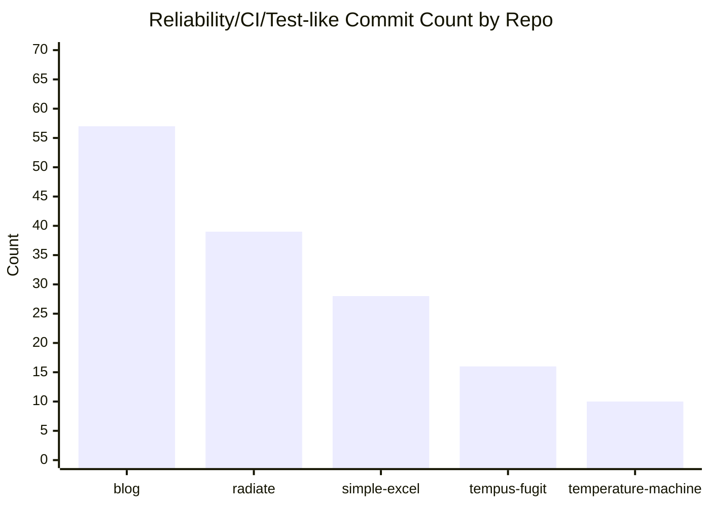
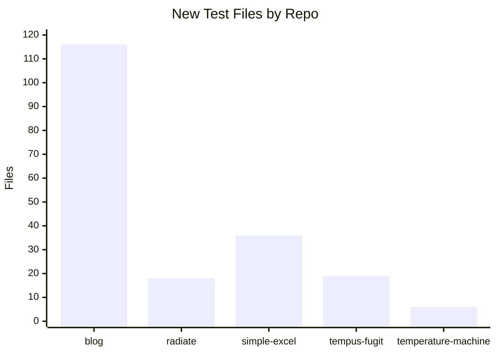
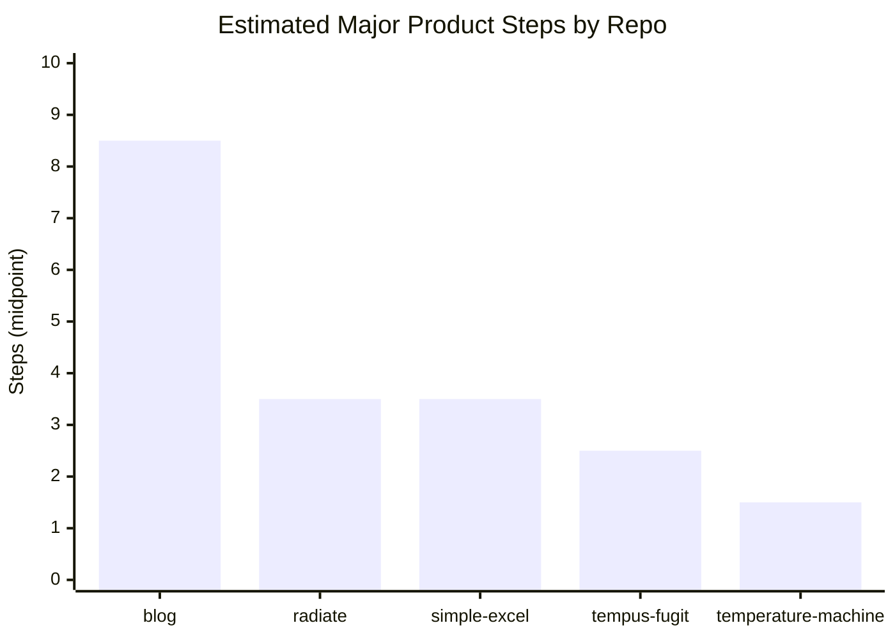
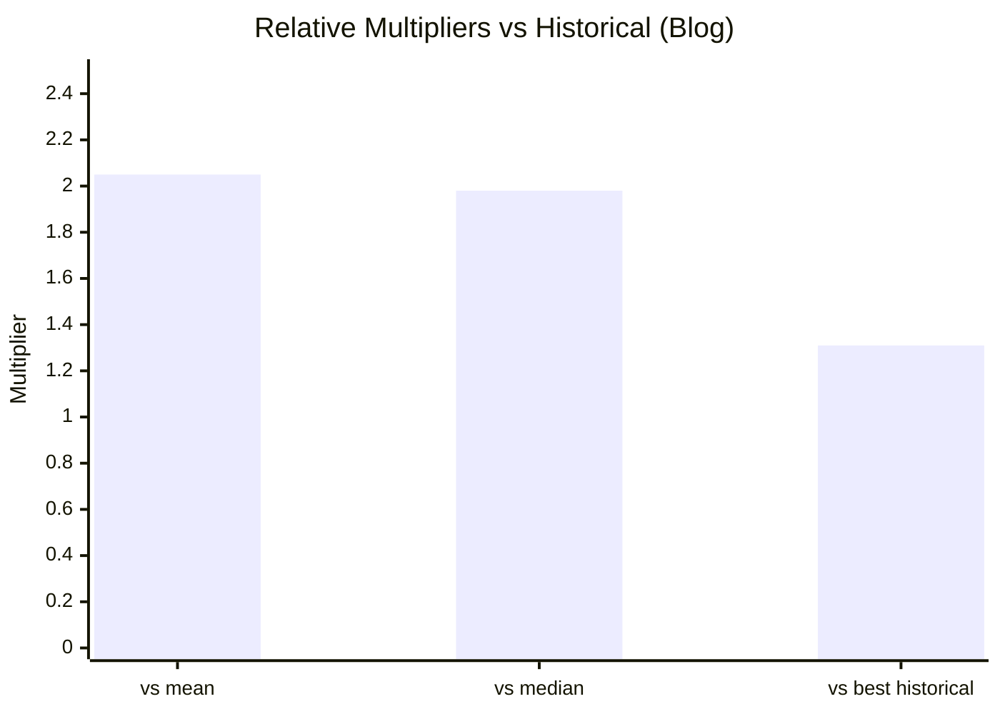

# AI Productivity Analysis (Feature-Level, Cross-Repo)

Date: 2026-03-07
Author scope: commits by `Toby`/`toby`
Window size: 28 days per repo (peak busy windows for historical repos)

## Goal

Quantify whether recent AI-assisted work produced more **feature/value throughput** than prior busy periods in other open-source projects, using coarse-grained delivery signals rather than lines of code alone.

## Compared Windows

| Repo                  | Window                   |
|-----------------------|--------------------------|
| `blog`                | 2026-02-08 to 2026-03-07 |
| `simple-excel`        | 2012-08-25 to 2012-09-21 |
| `tempus-fugit`        | 2009-11-30 to 2009-12-27 |
| `temperature-machine` | 2018-04-12 to 2018-05-09 |
| `radiate`             | 2013-07-24 to 2013-08-20 |

## Raw Delivery Signals

| Repo                  | Commits | New Files | New Code Files | New Test Files | Feature-like Commits | Fix-like Commits | Reliability/CI/Test-like Commits |
|-----------------------|--------:|----------:|---------------:|---------------:|---------------------:|-----------------:|---------------------------------:|
| `blog`                |     196 |       225 |             52 |            116 |                   61 |               51 |                               57 |
| `simple-excel`        |     105 |        78 |             57 |             36 |                   37 |               25 |                               28 |
| `tempus-fugit`        |      76 |        40 |             31 |             19 |                   30 |                9 |                               16 |
| `temperature-machine` |     126 |        25 |              3 |              6 |                   17 |               10 |                               10 |
| `radiate`             |     146 |       125 |             96 |             18 |                   44 |               26 |                               39 |

Notes:
- `feature-like`, `fix-like`, `reliability/CI/test-like` are keyword-classified commit-message buckets.
- These are proxy signals, not perfect semantic truth.

## Feature-Value Index

To avoid raw-LOC bias, a normalized weighted index was used:

`FeatureValueIndex = 100 * (0.45*feature + 0.25*new_code + 0.20*new_tests + 0.10*reliability)`

where each component is normalized to the maximum observed across compared repos.

| Repo                  | FeatureValueIndex |
|-----------------------|------------------:|
| `blog`                |          **88.5** |
| `radiate`             |              67.4 |
| `simple-excel`        |              53.3 |
| `tempus-fugit`        |              36.3 |
| `temperature-machine` |              16.1 |

### Relative Multipliers (Recent `blog` vs historical)

- vs historical mean: **2.05x**
- vs historical median: **1.98x**
- vs best historical window (`radiate`): **1.31x**

## Coarse-Grained Product Steps (Qualitative Read)

Estimated count of major capability steps shipped in each window:

| Repo                  | Major Steps (estimated) | Examples                                                                                                                                                                                  |
|-----------------------|------------------------:|-------------------------------------------------------------------------------------------------------------------------------------------------------------------------------------------|
| `blog`                |                 **8-9** | Ghostwriter end-to-end flow, semantic RAG/indexing, CLI, dedicated Python CI/tests, visual-regression hardening, routing/canonical redirects, archive/search UX, SEO+discussion+analytics |
| `simple-excel`        |                     3-4 | API shaping, styling support maturation, release hardening                                                                                                                                |
| `tempus-fugit`        |                     2-3 | concurrency/deadlock capabilities plus docs/site packaging                                                                                                                                |
| `radiate`             |                     3-4 | exception/info display architecture, event/logging behavior, UI feature controls                                                                                                          |
| `temperature-machine` |                     1-2 | packaging/install/deployment stabilization with limited net-new core features                                                                                                             |

## Charts

## Findings

1. Recent `blog` activity is not just higher churn; it combines feature construction, reliability scaffolding, and productization in one window.
2. On feature/value proxies, recent `blog` work is about **2x** your typical historic peak OSS window and still about **1.3x** above your strongest historical comparator.
3. The largest AI-era gain appears to be **parallelized delivery**: building net-new subsystem capability while simultaneously tightening tests/CI and docs.

## Caveats

1. Commit-message classification is heuristic.
2. Repo age/tooling norms differ by era (older repos had less CI/workflow convention).
3. “Major step” counts are qualitative clustering, not automated semantic parsing.

## Bottom Line

A defensible estimate from this analysis is:

- **~2.0x coarse-grained feature productivity vs your historical average peak windows**
- **~1.3x vs your best historical peak window**

Practical band: **1.8x-2.3x** depending on weighting choices.

---

Companion initiative-sizing report:

- [FEATURE_SIZE_COMPARISON.md](FEATURE_SIZE_COMPARISON.md)
