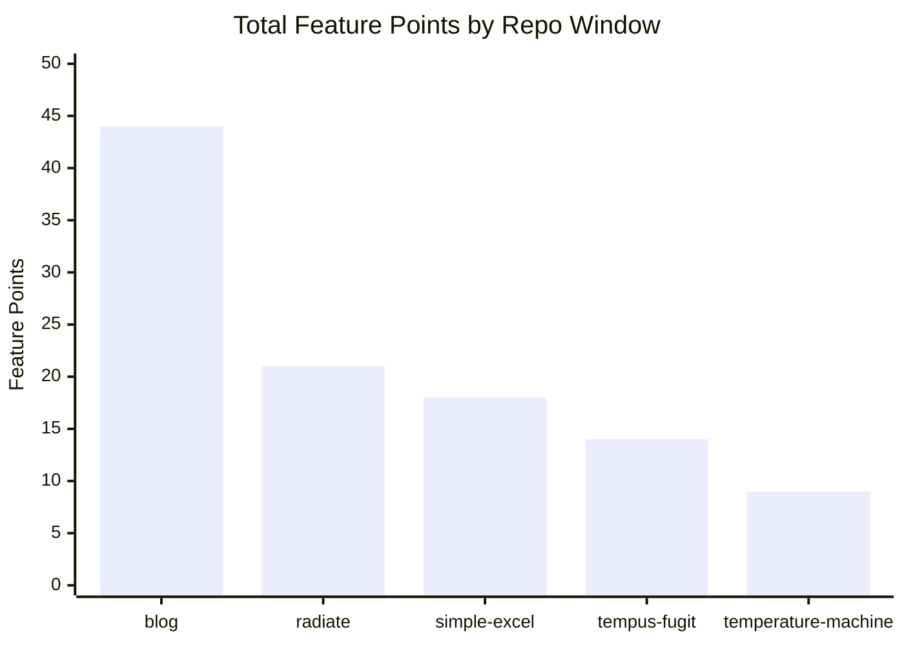
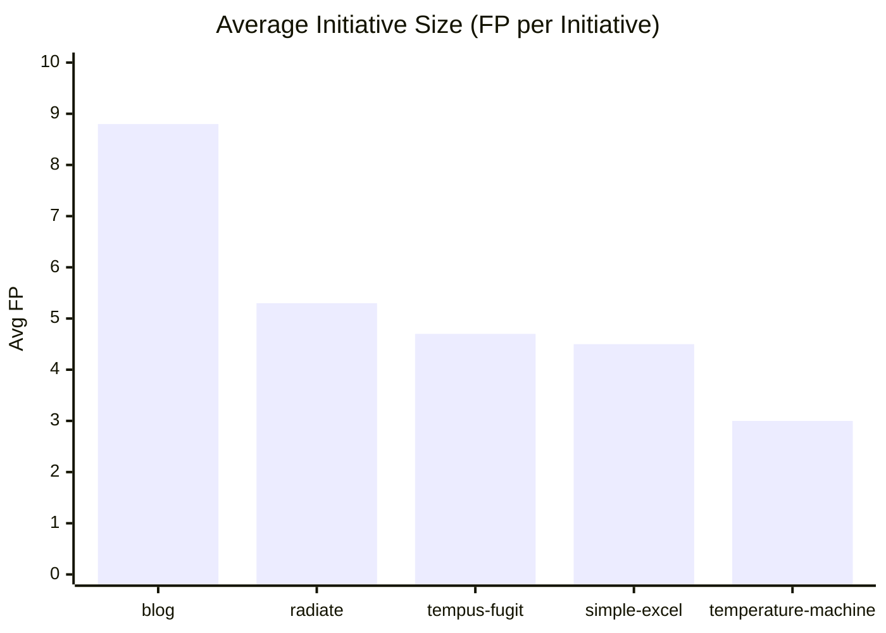

# Feature Size Comparison (Coarse-Grained Productivity)

Report that sizes work by initiative magnitude (big feature vs incremental tweak), and linked both reports together.

## What the new sizing model adds:

* A weighted Feature Size Score rubric across:
* novelty
  * technical depth
  * breadth
  * operational hardening
  * user impact
* Mapping to Feature Points (XS..XXL) so “Ghostwriter from scratch” scores much higher than minor tweaks.
* Initiative-by-initiative scoring for each repo window.
* Charts comparing total feature points and average initiative size.

## Headline results from the new model:

* blog window total: 44 Feature Points
* Historical windows: radiate 21, simple-excel 18, tempus-fugit 14, temperature-machine 9
* Relative:
   * 2.84x vs historical average
   * 2.10x vs best historical comparator

Date: 2026-03-07
Scope: Compare 28-day peak windows across repos by **initiative size**, not LOC.

## Why This Model

Raw commit/churn counts understate differences between:
- shipping a new subsystem from scratch
- polishing or tweaking existing behavior

This report sizes work as **initiatives** and scores their magnitude.

## Windows Compared

| Repo                  | Window                   |
|-----------------------|--------------------------|
| `blog`                | 2026-02-08 to 2026-03-07 |
| `simple-excel`        | 2012-08-25 to 2012-09-21 |
| `tempus-fugit`        | 2009-11-30 to 2009-12-27 |
| `temperature-machine` | 2018-04-12 to 2018-05-09 |
| `radiate`             | 2013-07-24 to 2013-08-20 |

## Sizing Rubric

Each initiative is scored 1-5 on:

1. **Novel Capability (30%)**: new behavior/system vs tweak.
2. **Technical Depth (25%)**: architecture or algorithmic depth.
3. **Surface Breadth (20%)**: how many subsystems/files/areas are impacted.
4. **Operational Hardening (15%)**: tests/CI/release/docs needed to make it real.
5. **User/Product Impact (10%)**: visible value to users or maintainers.

Composite:

`FSS = 20 * (0.30*N + 0.25*D + 0.20*B + 0.15*O + 0.10*U)`  (0-100)

Mapping to **Feature Points (FP)**:
- `>=85`: `XXL` = 13
- `70-84`: `XL` = 8
- `55-69`: `L` = 5
- `40-54`: `M` = 3
- `25-39`: `S` = 2
- `<25`: `XS` = 1

## Initiative Sizing

## `blog` (2026-02-08..2026-03-07)

| Initiative                                                                | N | D | B | O | U | FSS | Size | FP |
|---------------------------------------------------------------------------|--:|--:|--:|--:|--:|----:|------|---:|
| Ghostwriter core from scratch (plan/draft/revise/evaluate/CLI)            | 5 | 5 | 5 | 4 | 4 |  95 | XXL  | 13 |
| Semantic RAG + chunking + index + retrieval integration                   | 5 | 5 | 4 | 3 | 4 |  89 | XXL  | 13 |
| Testing+CI hardening (Ghostwriter + visual test stabilization)            | 3 | 3 | 4 | 5 | 3 |  71 | XL   |  8 |
| Site IA/UX/routing improvements (archive/search/redirect/infinite scroll) | 3 | 3 | 4 | 3 | 4 |  67 | L    |  5 |
| SEO/community/observability additions (JSON-LD/robots/llms/Giscus/GA)     | 3 | 2 | 3 | 3 | 3 |  56 | L    |  5 |

**Total FP: 44**

## `simple-excel` (2012-08-25..2012-09-21)

| Initiative                                               | N | D | B | O | U | FSS | Size | FP |
|----------------------------------------------------------|--:|--:|--:|--:|--:|----:|------|---:|
| API abstraction reshaping (`Workbook`/`Cell` interfaces) | 4 | 4 | 3 | 3 | 4 |  75 | XL   |  8 |
| Styling and cell-update behavior expansion               | 3 | 3 | 2 | 3 | 3 |  57 | L    |  5 |
| Release/packaging hardening around 1.0                   | 2 | 2 | 3 | 4 | 3 |  53 | M    |  3 |
| Docs clarification                                       | 1 | 1 | 1 | 2 | 2 |  25 | S    |  2 |

**Total FP: 18**

## `tempus-fugit` (2009-11-30..2009-12-27)

| Initiative                                               | N | D | B | O | U | FSS | Size | FP |
|----------------------------------------------------------|--:|--:|--:|--:|--:|----:|------|---:|
| Concurrency/deadlock/intermittent-test capabilities      | 4 | 4 | 3 | 3 | 4 |  75 | XL   |  8 |
| Site/docs/deploy skin and publishing pipeline            | 2 | 2 | 3 | 3 | 2 |  47 | M    |  3 |
| Supportive testing and cleanup around those capabilities | 2 | 2 | 2 | 3 | 2 |  43 | M    |  3 |

**Total FP: 14**

## `temperature-machine` (2018-04-12..2018-05-09)

| Initiative                                         | N | D | B | O | U | FSS | Size | FP |
|----------------------------------------------------|--:|--:|--:|--:|--:|----:|------|---:|
| Packaging/install/runtime scripts hardening        | 3 | 3 | 3 | 4 | 4 |  65 | L    |  5 |
| Documentation restructuring for install/onboarding | 1 | 1 | 2 | 2 | 2 |  28 | S    |  2 |
| Small operational bug fixes                        | 1 | 1 | 1 | 2 | 2 |  25 | S    |  2 |

**Total FP: 9**

## `radiate` (2013-07-24..2013-08-20)

| Initiative                                              | N | D | B | O | U | FSS | Size | FP |
|---------------------------------------------------------|--:|--:|--:|--:|--:|----:|------|---:|
| Exception/info display subsystem (HUD/dialog behaviors) | 4 | 4 | 4 | 3 | 4 |  79 | XL   |  8 |
| Logging/event observability refactor                    | 3 | 4 | 3 | 3 | 3 |  66 | L    |  5 |
| UI controls + thread-safety improvements                | 3 | 3 | 3 | 3 | 3 |  60 | L    |  5 |
| Example mode enhancements and supporting UX             | 2 | 2 | 2 | 2 | 3 |  44 | M    |  3 |

**Total FP: 21**

## Comparative Results

| Repo                  | Total FP | # Initiatives | Avg FP/Initiative |
|-----------------------|---------:|--------------:|------------------:|
| `blog`                |   **44** |             5 |           **8.8** |
| `radiate`             |       21 |             4 |               5.3 |
| `simple-excel`        |       18 |             4 |               4.5 |
| `tempus-fugit`        |       14 |             3 |               4.7 |
| `temperature-machine` |        9 |             3 |               3.0 |

Historical baseline (non-`blog`) average Total FP = `(21+18+14+9)/4 = 15.5`.

Relative multipliers for recent `blog`:
- vs historical average: **2.84x**
- vs best historical (`radiate`): **2.10x**

## Charts

## Interpretation

1. Recent `blog` work is not only higher volume; it is materially larger in initiative size.
2. The standout difference is stacked delivery of two XXL initiatives in one 28-day period:
   - Ghostwriter platform creation
   - Semantic retrieval architecture
3. Historical peaks were productive but more often centered on one main axis (API, UI, packaging, or docs), whereas recent work combined:
   - product capability
   - reliability/CI hardening
   - integration/distribution improvements

## Uncertainty / Guardrails

1. Initiative grouping is human-judgment based.
2. FP values should be read as **relative sizing**, not absolute truth.
3. Reasonable error band is about ±15-20%; ranking is more stable than exact values.

## Practical Use

Use this as a recurring KPI:

- `Total FP / 28 days`
- `Avg FP per initiative`
- `# initiatives >= XL`

This trio captures:
- how much you shipped,
- how big each step was,
- whether you are doing transformative work vs routine maintenance.

---

Companion metric-first report:

- [AI_PRODUCTIVITY_ANALYSIS.md](AI_PRODUCTIVITY_ANALYSIS.md)
