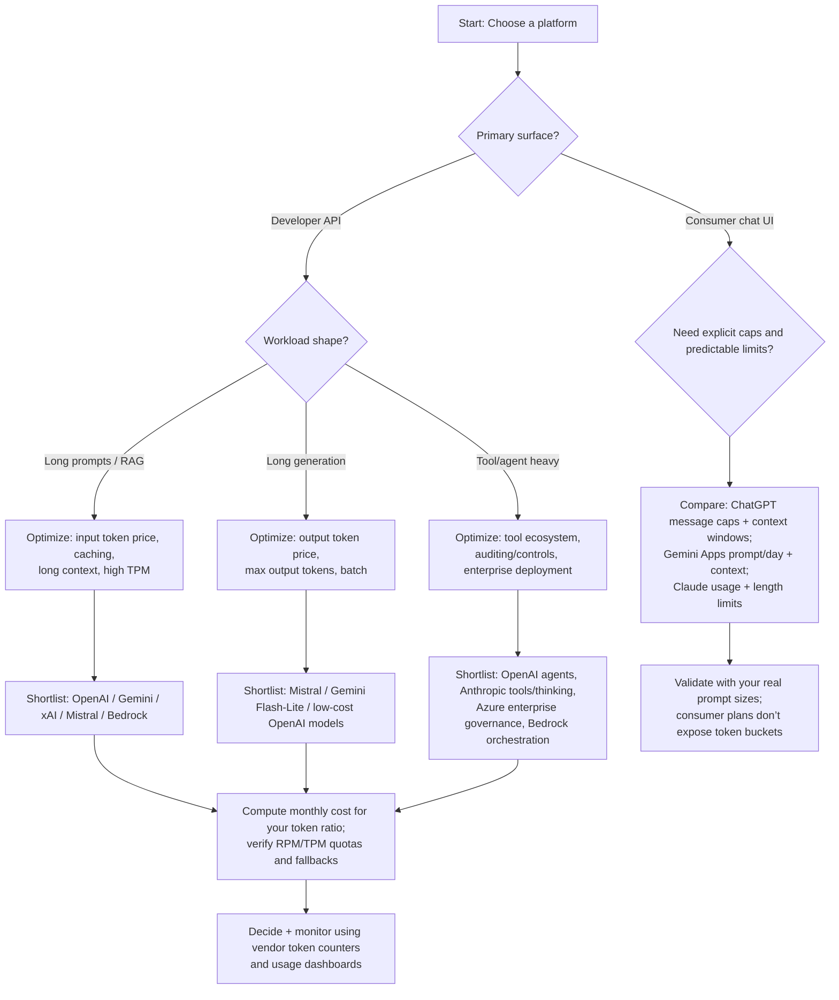

# Do deep research on comparative analysis of major AI platforms and token-based usage policies

## User-facing summary

This report explains how major AI platforms package services for customers (consumer subscriptions, developer APIs, and enterprise/committed use), with a focus on **token-based usage**, **caps/limits**, and **developer experience**. It highlights why users often *feel* they “run out” faster on one platform than another: tokenization is model-specific, consumer products often meter usage via **message/prompt budgets** (not token buckets), and hidden overhead (conversation history, tools, system prompts, reasoning tokens) can materially change how quickly limits are reached. citeturn13search0turn13search2turn14search21turn16view0turn25view0turn15view3

For an “average developer” workload (per your definition) of **2M input + 1M output tokens/month**, the **API-equivalent** monthly spend varies substantially depending on which vendor/model you pick (and whether you use batch/caching discounts). Using a representative low-cost model from each platform with published per-token prices, the computed *illustrative* monthly cost ranges from **~$0.30/month** (Mistral Ministral 8B) to **~$7/month** (Anthropic Claude Haiku 4.5). These are **API-only** comparisons, not consumer subscription entitlements. citeturn12search3turn6view3turn20view1turn6view2turn17view2turn1search4

**Downloadable Markdown report (with charts + a CSV of calculations):**  
[Download the Markdown file](sandbox:/mnt/data/ai-platform-token-policies-comparison-2026-03-14.md)  
[Download the pricing calculation CSV](sandbox:/mnt/data/pricing_computation_table.csv)  
[Download chart: tokens per $20](sandbox:/mnt/data/tokens_per_20_usd_api_equivalent.png)  
[Download chart: monthly cost](sandbox:/mnt/data/monthly_cost_median_hobbyist.png)

## Executive summary

Tokens are the internal accounting unit used by LLMs to represent text. A token can be a whole word, a word fragment, whitespace, punctuation, or other subword pieces. For English, both OpenAI and Google publish rough rules of thumb: **~4 characters per token**, and roughly **¾ of a word per token** (OpenAI); Gemini also uses ~4 characters/token and **100 tokens ≈ 60–80 words** as a rough guide. These are approximations, not guarantees. citeturn13search0turn13search3

“Tokens” are **not interchangeable across vendors**, because tokenization is **model-specific**. Cohere explicitly notes tokenizers differ by model and provides tokenization tooling; AWS Bedrock’s CountTokens API similarly stresses that token counting varies by model/tokenization strategy and that its CountTokens result matches what would be charged for inference. citeturn13search2turn14search21

Across platforms, token economics and “running out” experiences are shaped by **three stacked layers of constraints**:

- **Per-request limits** (context window + max output tokens). Chat consumer apps (ChatGPT, Gemini Apps, Claude) publish context-window limits (often different by tier), and APIs publish context-window and max-output limits in model documentation. citeturn25view0turn15view3turn16view0turn14search7turn14search6turn13search15
- **Rate limits / quotas** like RPM/TPM. Many vendors make these explicit in docs (Anthropic, Google Gemini API, xAI, Cohere, AWS Bedrock); enterprise channels often allow quota increases or reserved capacity. citeturn1search31turn1search25turn1search23turn5search2turn5search1turn14search0
- **Plan-level policies**: consumer apps often meter via message/prompt caps, “fair use,” feature caps, and/or “premium request” allowances rather than publishing a token bucket. Examples: ChatGPT Plus/Go message caps and Thinking weekly caps; Gemini Apps prompt/day caps by plan; Claude consumer “conversation budget” and context-length limits; GitHub Copilot’s “premium requests” and plan allowances. citeturn25view0turn15view3turn16view0turn3search23turn3search16

This layering explains why naive “$20/month = X tokens” comparisons are usually invalid for consumer subscriptions: the product doesn’t sell tokens; it sells **time-windowed interaction** with guardrails and a tiered model picker. citeturn25view0turn15view3turn16view0

## Definitions and methodology

Tokens are formed by a tokenizer (often BPE / SentencePiece-like) that maps text to integer IDs. OpenAI describes tokens and provides rules-of-thumb for English and examples showing that tokenization varies by language and text content. citeturn13search0

Google’s Gemini documentation similarly defines tokens and provides rules-of-thumb, and points developers to token counting tooling. citeturn13search3

Two primary “rigor” points used throughout this report:

1. **Model-specific tokenization**: token counts differ across models/vendors; you should use each vendor’s official token counters to forecast cost/limits. Cohere provides `tokenize/detokenize` tooling; AWS Bedrock’s CountTokens explicitly states token counting is model-specific and matches what would be charged. citeturn13search2turn14search21
2. **Workload normalization**: to compare API economics, this report uses your “average developer” assumption: **2M input + 1M output tokens/month** (total 3M tokens/month at a 2:1 ratio). This is used only for **API** comparisons, because consumer subscriptions do not usually publish token allowances. citeturn25view0turn15view3turn16view0

## Service models and token billing rules

This section summarizes how platforms sell services to customers and what token billing primitives exist.

To keep the comparison concrete, the vendors in scope are: entity["company","OpenAI","ai company, us"], entity["company","Anthropic","ai company, us"], entity["company","Google","tech company, us"], entity["company","Microsoft","tech company, us"], entity["company","GitHub","software company, us"], entity["company","xAI","ai company, us"], entity["company","Cohere","ai company, canada"], entity["company","Mistral AI","ai company, france"], and entity["company","Amazon Web Services","cloud provider, us"]. citeturn25view0turn15view3turn16view0turn17view2turn1search4turn20view1turn6view2turn6view3turn12search3turn6view1

**OpenAI**
- **Consumer model**: ChatGPT tiers use explicit **message caps** per time window and tiered access to models; after reaching caps, ChatGPT can switch to a smaller model until reset. ChatGPT also publishes tier-specific **context windows** (e.g., Plus/Business vs Pro/Enterprise differ). citeturn25view0
- **API model**: per-token billing (input/output), with optional **cached input** pricing and batch discounts via Batch API. citeturn17view2turn22search15

**Anthropic**
- **Consumer model**: Claude consumer usage is governed by **usage limits (“conversation budget”)** and **length limits (context window)**; usage depends on conversation length/complexity and features, and usage across multiple Claude surfaces counts together (per the consumer help doc). citeturn16view0
- **API model**: per-token billing with **prompt caching** (cache write/read) and Batch options on the pricing page; “extended thinking” can create additional billed output tokens beyond visible text. citeturn1search4turn1search28turn1search33

**Google Gemini and Vertex AI**
- **Consumer model**: Gemini Apps has plan-based caps (prompts/day, feature limits) and publishes plan-specific **context sizes**. Limits may change and are distributed throughout the day. citeturn15view3turn15view0
- **API model**: Gemini API pricing is per token with **context caching price** and an explicit **storage price** for cached context; some models have **Batch** pricing; output pricing may include “thinking tokens” per the pricing tables. citeturn20view1turn20view0
- **Vertex AI**: the Vertex model reference and token docs reinforce token semantics and usage parameters (e.g., `maxOutputTokens`) and the ~4-character token rule. citeturn13search15turn13search3

**Microsoft Azure OpenAI and GitHub Copilot**
- **Azure OpenAI service model**: Microsoft describes (a) **Standard on-demand** token billing, (b) **Provisioned throughput units (PTUs)** with reservations, and (c) **Batch API** at “50% discount on Global Standard Pricing,” plus different deployment types (Global / Data Zone / Regional). citeturn21view0turn22search11  
  *Practical limitation:* Azure’s public pricing table is dynamically rendered and did not expose stable per-model token rates in the static HTML view used for this research; therefore this report treats Azure’s “per-token price for model X” as **vendor-published but not machine-extractable here**, and recommends using the Azure pricing calculator/portal for your region and agreement. citeturn21view0turn22search11
- **GitHub Copilot model**: Copilot is primarily sold as a **seat-based subscription**. Usage is often described in completions/chat interactions and monthly **premium request** allowances (not token buckets), with overage pricing per premium request (per the VS Code Copilot Free announcement) and plan pages. citeturn3search23turn3search16turn3search18

**xAI**
- **API model**: xAI publishes per-model prices per million tokens and large context windows for some models. citeturn6view2
- xAI documentation also publishes per-model rate limit tiers and shows cached-input pricing and Batch discounts (50%) in docs. citeturn4search7turn4search1turn1search23

**Cohere**
- **API model**: per-token pricing for Command family models is published (input/output per 1M tokens). citeturn6view3
- Cohere documents rate limits and distinguishes evaluation vs production keys; Cohere FAQs mention production keys are rate-limited (e.g., 1000 calls per minute). citeturn5search2turn5search6
- Cohere provides tokenization tooling (`tokenize/detokenize` and downloadable tokenizers). citeturn13search2

**Mistral**
- **Consumer model**: Mistral publishes Le Chat subscription plan pricing and feature limits (e.g., “flash answers per day” and other feature multipliers). citeturn10view0
- **API model**: Mistral publishes per-token prices in product/news posts for key models (e.g., Ministral, Medium 3, Devstral). citeturn12search3turn9view0turn12search0
- Some endpoints explicitly mention Batch API pricing (e.g., Codestral Embed with batch discount) and Mistral publishes rate-limit tiers. citeturn12search8turn5search3

**AWS Bedrock**
- **Platform model**: Bedrock is a multi-model platform with pricing dependent on selected model/provider and service tier; it supports Batch inference and other platform features. citeturn6view1
- **Token accounting nuance**: Bedrock’s token quota management can deduct capacity at request start based on **(total input tokens + max_tokens)**, which means setting a high `max_tokens` can consume quota even if the model returns a short completion. citeturn14search0
- AWS publishes CountTokens tools and prompt caching docs; prompt caching charges cached tokens at reduced rates and may charge cache writes differently depending on model. citeturn14search4turn14search5turn14search21

## Token limits, rate limits, and “why it feels like I ran out?”

This section focuses on the “developer experience reality”: you hit limits in product UI or API before you hit your budget (or vice versa).

ChatGPT publishes explicit message caps per tier and model (example: Plus/Go “up to 160 messages with GPT-5.3 every 3 hours”; manual Thinking “up to 3,000 messages per week”) and also publishes tier-specific context windows. This makes limits **transparent**, but not token-bucket-style. citeturn25view0

Gemini Apps publishes daily prompt limits by plan and model class plus plan-specific context sizes (e.g., 32K / 128K / 1M). It also states limits can change and are distributed across the day; if you hit a higher-tier model’s limit you may continue with a lower-tier model. citeturn15view3turn15view0

Claude’s consumer help docs frame limits as:
- **Usage limits**: a “conversation budget” whose depletion depends on conversation length/complexity, features, tools/connectors, and chosen model.
- **Length limits**: context window constraints, with additional guidance around automatic context management and token-intensive tools/connectors. citeturn16view0

These consumer UX patterns are the biggest reason users perceive that “Claude runs out faster than Copilot” when doing developer tasks:

- Claude’s consumer product explicitly ties availability to a shared “conversation budget” and a large but finite context window, and it warns that tools/connectors are token-intensive. citeturn16view0
- GitHub Copilot’s consumer/dev tooling tends to meter by **requests**, **completions**, and **premium request** allowances (not a visible token pool), and IDE contexts are often smaller snippets rather than giant chat transcripts. citeturn3search23turn3search16

On the API side, “running out” often means hitting RPM/TPM quotas rather than spending money. AWS Bedrock documents token quota burndown behavior (input + max_tokens) that can make quota exhaustion feel surprising; it also provides CountTokens to predict and align with charged tokens. citeturn14search0turn14search21turn14search4

## Worked examples, calculations, and charts

### Worked example for a 1,000-word English document

You asked for tokenization across representative tokenizers. Because tokenization is model-specific and the exact tokenizers (and their vocabularies) vary across vendors/models, the most rigorous approach is to use each vendor’s official token counters:

- OpenAI tokenizer tool and token guidance. citeturn13search4turn13search0
- Gemini token docs (and count-tokens tooling referenced there). citeturn13search3
- AWS Bedrock CountTokens docs (model-specific; matches charged tokens). citeturn14search4turn14search21
- Cohere tokenization tooling. citeturn13search2

What we can do analytically (without calling those token counters) is provide **bounded estimates** using vendor-published rules-of-thumb:

- **OpenAI estimate:** 100 tokens ≈ 75 words ⇒ 1,000 words ≈ **~1,333 tokens**. citeturn13search0
- **Gemini estimate:** 100 tokens ≈ 60–80 words ⇒ 1,000 words ≈ **~1,250–1,667 tokens**. citeturn13search3

These ranges already demonstrate a real-world impact: a “1,000-word doc” can plausibly be a **~25–30% swing** in token count depending on tokenizer and assumptions, before you account for punctuation, code blocks, or non-English text. citeturn13search0turn13search3turn14search21

### Cost to process 1M tokens and the average developer workload

A common benchmark is “cost per 1M input tokens” and “cost per 1M output tokens,” since vendors publish pricing that way. For a workload with 2:1 input:output ratio, monthly cost is:

`Monthly cost = 2 × (price per 1M input tokens) + 1 × (price per 1M output tokens)`

The charts and CSV provided with this report compute the “average developer” workload you specified: **2M input + 1M output tokens/month**.

**Representative published price points used for the charts (USD per 1M tokens):**
- OpenAI: from the OpenAI developer pricing page (example: gpt-4.1-nano input/output pricing). citeturn17view2
- Anthropic: Claude Haiku 4.5 price points from the Anthropic pricing page. citeturn1search4
- Google Gemini: Gemini 2.5 Flash-Lite price points from Gemini API pricing tables. citeturn20view1
- xAI: grok fast model pricing from the xAI API page. citeturn6view2
- Cohere: Command-light pricing from the Cohere pricing page. citeturn6view3
- Mistral: Ministral pricing from Mistral’s “ministraux” post. citeturn12search3
- AWS Bedrock: Titan Text Lite token prices inferred directly from AWS’s official Bedrock pricing example for that model. citeturn19view2

**Interpretation rule:** The “tokens per $20” chart is explicitly **API-equivalent**—it answers: *if you spent $20 on the API at a fixed 2:1 input:output ratio*, how many tokens would you process. It does **not** claim any consumer subscription grants that many tokens. Consumer products meter differently (messages/prompts/features). citeturn25view0turn15view3turn16view0turn3search23

## Vendor comparison table and selection flowchart

### Table: pricing units, limits, caching/batch, and developer-visible quotas

| Vendor/platform | Pricing unit(s) exposed to devs | Published plan caps & token limits (examples) | Rate limits / quotas (high level) | Caching / batch options | Developer-visible quota tools |
|---|---|---|---|---|---|
| OpenAI | Input/output tokens; cached input tokens; some tool-call units | ChatGPT tiers publish messages per time window + context windows by tier; Thinking caps for manual selection | OpenAI documents rate limits by model/account tier | Batch API (50% lower costs) and cached input pricing | Tokenizer tool + token guidance; usage dashboards |
| Anthropic | Input/output tokens; caching write/read; “thinking” can add billed output tokens | Claude consumer: usage vs length limits; consumer context window guidance; API models can have larger context (incl. 1M beta for some models) | Rate limits documented; cached tokens can interact with limits depending on model | Prompt caching; Batch pricing; extended thinking controls | Console + API docs for counting/caching |
| Google Gemini / Vertex | Input/output tokens; output may include thinking tokens; caching + storage costs | Gemini Apps publishes prompts/day and plan context sizes; API model tiers published | Gemini API rate limits documented | Batch pricing for some models; context caching price + storage price | countTokens tooling; AI Studio/Cloud Console quotas |
| Microsoft Azure OpenAI | Input/output tokens (pricing varies by deployment); PTUs | Deployment type differences (Global/Data Zone/Regional), Batch 50% discount for some workloads | Azure exposes quotas/limits in portal; batch has separate quota | Batch API; PTU reservations | Azure portal quotas/metrics |
| GitHub Copilot | Premium requests / completions (plan-defined), not tokens | Free plan publishes completion/chat caps; paid plans publish premium request allowances and overage pricing | Service-level limits exist; primary metering is plan-based | Not exposed as token caching | Copilot usage/billing views |
| xAI | Input/output tokens; some cached input pricing | Model pages publish large context windows | Rate limits documented; per-tier limits published | Batch discount; cached input pricing | Model pages + docs + console |
| Cohere | Input/output tokens for Command; other endpoints vary | Pricing page publishes token rates; “trial vs production” key constraints | Rate limits documented; FAQs mention production-key per-minute call limits | Token caching not emphasized as a billing primitive | Tokenize/detokenize tooling + docs |
| Mistral | Per-token pricing for many models; Le Chat subscription limits | Subscription feature caps; API pricing published in posts for key models | Rate-limit tiers published for API | Batch discount available for some endpoints | Mistral console + docs |
| AWS Bedrock | Per-token by chosen model/provider; non-token units for certain platform tools | Quota burndown can reserve (input + max_tokens); platform supports multiple tiers | Quotas documented; throttling based on TPS/RPM/TPM | Prompt caching; Batch inference (tier dependent) | CountTokens API + AWS console/metrics |

Citations supporting key platform claims: OpenAI ChatGPT limits and context windows citeturn25view0; OpenAI Batch API citeturn22search15; OpenAI pricing citeturn17view2; Anthropic pricing/caching/thinking/rate limits citeturn1search4turn1search28turn1search33turn1search31; Claude consumer limits citeturn16view0; Gemini Apps limits citeturn15view3; Gemini API pricing citeturn20view1; Gemini API rate limits citeturn1search25; Azure OpenAI pricing modes citeturn21view0turn22search11; GitHub Copilot plan allowances citeturn3search23turn3search16; xAI pricing and docs citeturn6view2turn4search1turn4search7turn1search23; Cohere pricing/tokenizers/rate limits citeturn6view3turn13search2turn5search2turn5search6; Mistral pricing/rate tiers/batch mention citeturn12search3turn9view0turn12search8turn5search3turn10view0; AWS Bedrock pricing/quota/token tools/caching citeturn6view1turn5search1turn14search0turn14search4turn14search5turn14search21.

